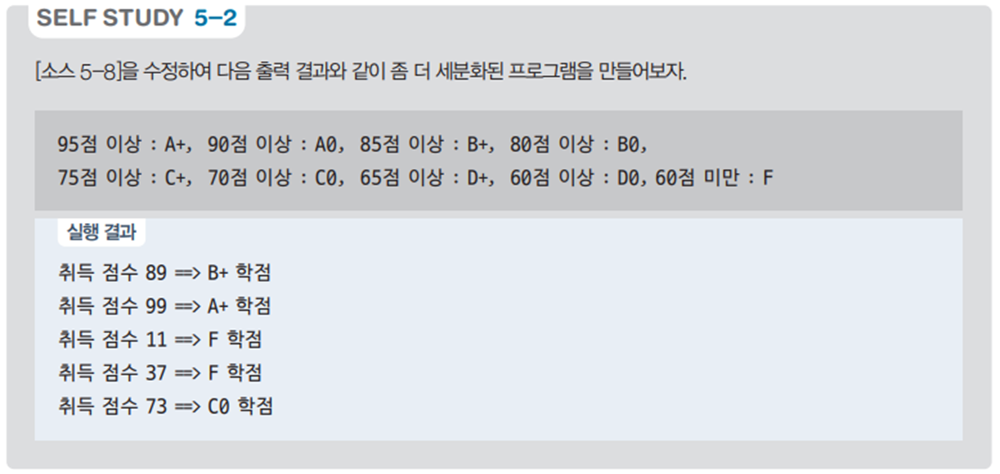

# 랜덤 점수 학점 부여 프로그램 - 점수에 따른 학점 예제

## 문제 설명

랜덤으로 생성된 점수에 따라 해당 점수에 맞는 학점을 부여하여 출력하는 C# 프로그램을 작성한다. 이 프로그램은 기본적인 콘솔 입출력과 랜덤 숫자 생성 기능을 활용하여 학점을 자동으로 매기는 연습에 유용하다.



## 코드 풀이

이 프로그램은 다음과 같은 이유로 작성되었다:

### 주요 코드 설명

- **랜덤 점수 생성 및 학점 부여**
  - `Random` 클래스를 사용하여 0부터 100 사이의 랜덤한 점수를 생성하고, 해당 점수에 맞는 학점을 출력한다. 학점은 다음과 같이 부여한다:
    - 95 이상: A+
    - 90 이상: A0
    - 85 이상: B+
    - 80 이상: B0
    - 75 이상: C+
    - 70 이상: C0
    - 65 이상: D+
    - 60 이상: D0
    - 그 외: F

  ```csharp
  Random random = new Random();
  for (int i = 0; i < 5; i++)
  {
      int score = random.Next(0, 101);
      if (score >= 95)
          print.WriteLine($"취득 점수 {score} => A+ 학점");
      else if (score >= 90)
          print.WriteLine($"취득 점수 {score} => A0 학점");
      else if (score >= 85)
          print.WriteLine($"취득 점수 {score} => B+ 학점");
      else if (score >= 80)
          print.WriteLine($"취득 점수 {score} => B0 학점");
      else if (score >= 75)
          print.WriteLine($"취득 점수 {score} => C+ 학점");
      else if (score >= 70)
          print.WriteLine($"취득 점수 {score} => C0 학점");
      else if (score >= 65)
          print.WriteLine($"취득 점수 {score} => D+ 학점");
      else if (score >= 60)
          print.WriteLine($"취득 점수 {score} => D0 학점");
      else
          print.WriteLine($"취득 점수 {score} => F 학점");
  }
  ```

## 정리

이 프로그램은 랜덤하게 생성된 점수를 학점으로 변환하여 출력하는 예제이다. 점수에 따라 학점을 부여하는 조건문을 통해 학점 부여의 기준을 이해하고, `Random` 클래스를 활용하여 다양한 입력값을 시뮬레이션하는 데 도움이 된다.