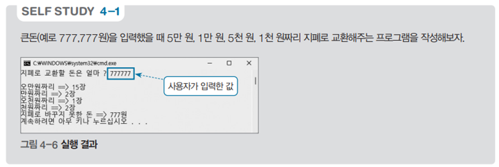

# 돈 교환 프로그램 - 지폐로 교환하기 예제

## 문제 설명

사용자가 입력한 금액을 다양한 지폐 단위로 교환하는 C# 프로그램을 작성한다.


## 코드 풀이

이 프로그램은 다음과 같은 이유로 작성되었다:

### 주요 코드 설명

- **UTF-8 인코딩 설정**

  - `Console.InputEncoding`과 `Console.OutputEncoding`을 UTF-8로 설정하여 콘솔 입출력에서 다양한 문자를 지원한다. 이를 통해 한글과 같은 문자를 제대로 출력할 수 있다.

- **입출력 성능 개선을 위한 버퍼 사용**

  - `StreamReader`와 `StreamWriter`를 사용하여 콘솔의 입출력을 처리하며, `AutoFlush`를 통해 출력 버퍼가 자동으로 비워지도록 설정하여 사용자에게 즉각적인 출력 결과를 제공한다. `Console` 클래스의 기본 입출력 방식은 속도가 느리기 때문에 버퍼를 사용하여 성능을 개선하였다.

- **금액 입력 및 지폐 교환 계산**

  - 사용자에게 교환할 금액을 입력받아 각 지폐 단위별로 몇 장이 필요한지 계산하여 출력한다. 예를 들어, 5만 원, 1만 원, 5천 원, 1천 원 단위로 나누어 필요한 지폐의 개수를 계산한다.

  ```csharp
  print.Write("지폐로 교환할 돈은 얼마 ? ");
  int money = Convert.ToInt32(read.ReadLine());

  print.WriteLine($"오만원짜리 => {money / 50000}장");
  print.WriteLine($"만원짜리 => {(money %= 50000) / 10000}장");
  print.WriteLine($"오천원짜리 => {(money %= 10000) / 5000}장");
  print.WriteLine($"천원짜리 => {(money %= 5000) / 1000}장");
  print.Write($"지폐로 바꾸지 못한 돈 => {money %= 1000}원");
  ```

## 정리

이 프로그램은 사용자가 입력한 금액을 다양한 지폐 단위로 교환하여 출력하는 예제이다. 입출력 성능 개선을 위해 버퍼를 사용하였다.