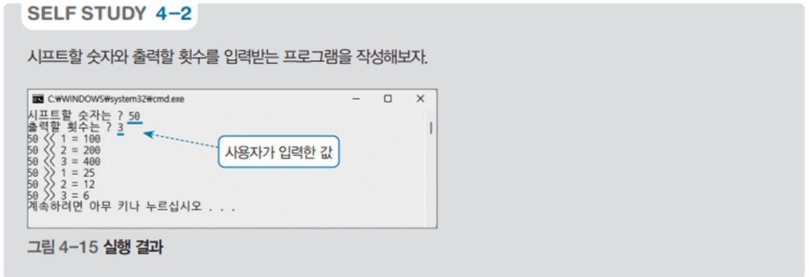

# 시프트 연산 프로그램 - 숫자 시프트 예제

## 문제 설명

사용자가 입력한 숫자를 왼쪽과 오른쪽으로 시프트 연산하여 결과를 출력하는 C# 프로그램을 작성한다.



## 코드 풀이

이 프로그램은 다음과 같은 이유로 작성되었다:

### 주요 코드 설명

- **입출력 성능 개선을 위한 버퍼 사용**
  - `StreamReader`와 `StreamWriter`를 사용하여 콘솔의 입출력을 처리하며, `AutoFlush`를 통해 출력 버퍼가 자동으로 비워지도록 설정하여 사용자에게 즉각적인 출력 결과를 제공한다. `Console` 클래스의 기본 입출력 방식은 속도가 느리기 때문에 버퍼를 사용하여 성능을 개선하였다.

- **숫자 입력 및 시프트 연산 수행**
  - 사용자에게 시프트할 숫자와 출력할 횟수를 입력받아 각 시프트 연산의 결과를 출력한다. 입력받은 숫자를 왼쪽으로 시프트(`<<`)하고, 오른쪽으로 시프트(`>>`)하여 그 결과를 출력한다.

  ```csharp
  print.Write("시프트할 숫자는 ? ");
  int num = Convert.ToInt32(read.ReadLine());

  print.Write("출력할 횟수는 ? ");
  int count = Convert.ToInt32(read.ReadLine());

  for (int i = 1; i <= count; i++)
      print.WriteLine($"{num} << {i} = {num << i}");

  for (int i = 1; i <= count; i++)
      print.WriteLine($"{num} >> {i} = {num >> i}");
  ```

## 정리

이 프로그램은 사용자가 입력한 숫자를 왼쪽 및 오른쪽으로 시프트 연산하여 그 결과를 출력하는 예제이다. 입출력 성능 개선을 위해 버퍼를 사용하였으며, 시프트 연산을 이해하고 활용하는 데 도움이 되는 간단한 프로그램이다.