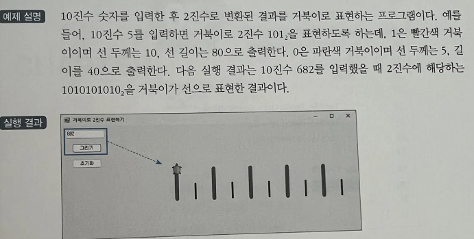

# 2진수 거북이 그래픽 프로그램 - 숫자 시각화 예제

## 문제 설명

사용자가 입력한 10진수 숫자를 2진수로 변환한 후, 그 결과를 거북이 그래픽으로 선을 그려 시각적으로 표현하는 C# 프로그램을 작성한다.



## 코드 풀이

이 프로그램은 다음과 같은 이유로 작성되었다:

### 주요 코드 설명

- **입력된 숫자를 2진수로 변환**
  - `Convert.ToString(Convert.ToInt32(InputBox.Text), 2)`를 사용하여 사용자가 입력한 10진수 숫자를 2진수 문자열로 변환한다.

- **거북이 그래픽을 통한 시각화**
  - Nakov.TurtleGraphics 라이브러리를 사용하여 변환된 2진수를 시각화한다. `1`인 경우에는 빨간색, 두께 10, 길이 80인 선을 그리며, `0`인 경우에는 파란색, 두께 5, 길이 40인 선을 그린다. 이를 통해 숫자를 시각적으로 직관적으로 이해할 수 있도록 한다.

  ```csharp
  string numStr = Convert.ToString(Convert.ToInt32(InputBox.Text), 2);
  Turtle.Delay = 100;

  for (int i = 0; i < numStr.Length; i++)
  {
      Turtle.PenUp();
      Turtle.MoveTo(Turtle.X + 20, 0); 
      Turtle.PenDown();

      if (numStr[i] == '1')
      {
          Turtle.PenSize = 10;
          Turtle.PenColor = Color.Red;
          Turtle.Forward(80);
      }
      else
      {
          Turtle.PenSize = 5;
          Turtle.PenColor = Color.Blue;
          Turtle.Forward(40);
      }
  }
  ```

## 정리

이 프로그램은 사용자가 입력한 숫자를 2진수로 변환하고, 이를 거북이 그래픽을 이용하여 시각적으로 표현하는 예제이다. 각 비트의 값에 따라 선의 색상과 두께, 길이를 달리하여 숫자를 직관적으로 이해할 수 있게 해준다. Nakov.TurtleGraphics 라이브러리를 활용하여 GUI 환경에서 시각적인 이해를 돕는 간단한 프로그램이다.