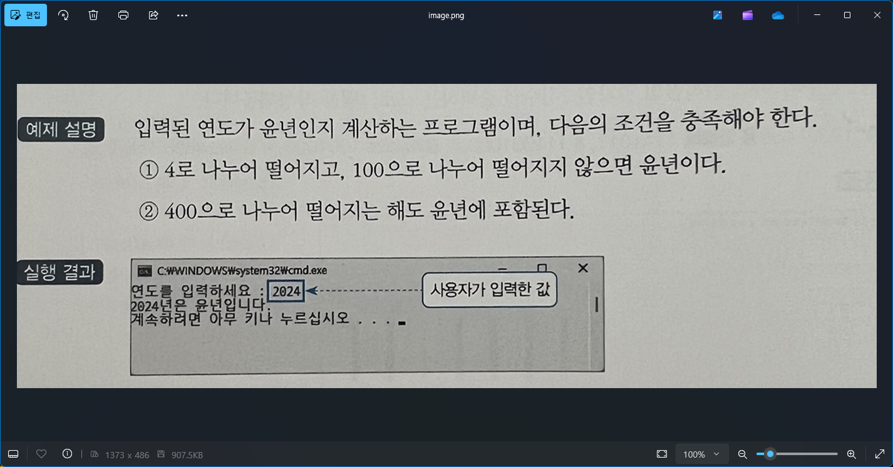

# 윤년 판단 프로그램 - 연도 입력 예제

## 문제 설명

사용자가 입력한 연도가 윤년인지 아닌지를 판단하여 결과를 출력하는 C# 프로그램을 작성한다.



## 코드 풀이

이 프로그램은 다음과 같은 이유로 작성되었다:

### 주요 코드 설명

- **입출력 성능 개선을 위한 버퍼 사용**
  - `StreamReader`와 `StreamWriter`를 사용하여 콘솔의 입출력을 처리하며, `AutoFlush`를 통해 출력 버퍼가 자동으로 비워지도록 설정하여 사용자에게 즉각적인 출력 결과를 제공한다. `Console` 클래스의 기본 입출력 방식은 속도가 느리기 때문에 버퍼를 사용하여 성능을 개선하였다.

- **연도 입력 및 윤년 판단**
  - 사용자에게 연도를 입력받아 해당 연도가 윤년인지 판단하고 결과를 출력한다. 윤년은 다음 조건에 따라 판단한다:
    1. 연도가 4로 나누어떨어지고 100으로 나누어떨어지지 않으면 윤년이다.
    2. 또는 연도가 400으로 나누어떨어지면 윤년이다.

  ```csharp
  print.Write("연도를 입력하세요 : ");
  int year = Convert.ToInt32(read.ReadLine());

  if (year % 4 == 0 && year % 100 != 0 || year % 400 == 0)
      print.Write($"{year}년은 윤년입니다.");
  else
      print.Write($"{year}년은 윤년이 아닙니다.");
  ```

## 정리

이 프로그램은 사용자가 입력한 연도가 윤년인지 아닌지를 판단하여 그 결과를 출력하는 예제이다. 입출력 성능 개선을 위해 버퍼를 사용하였으며, 윤년의 정의와 그 판단 조건을 이해하는 데 도움이 되는 간단한 프로그램이다.