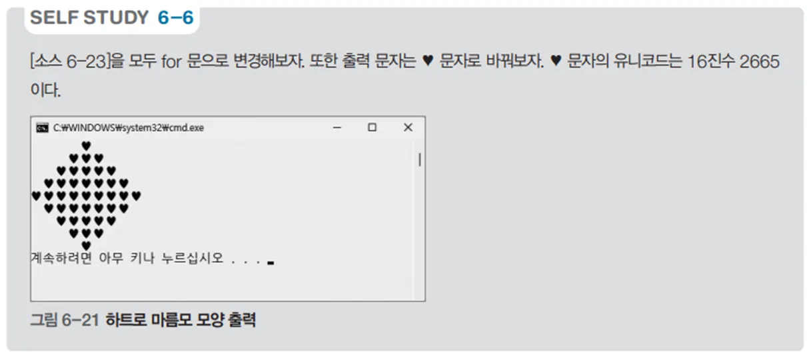

# 하트 모양 출력 프로그램 - 하트 패턴 예제

## 문제 설명

하트 모양을 출력하는 C# 프로그램을 작성한다. 이 프로그램은 반복문을 활용하여 하트 모양의 패턴을 출력하는 연습에 유용하다. 출력된 하트는 위쪽과 아래쪽 두 부분으로 나뉘며, 각 부분의 크기와 모양이 달라져 다양한 반복문 조합을 연습할 수 있다.



## 코드 풀이

이 프로그램은 다음과 같은 이유로 작성되었다:

### 주요 코드 설명

- **하트 모양 상단 출력**
  - 첫 번째 반복문은 하트 모양의 상단 부분을 출력한다. `i`에 따라 공백의 개수를 조정하여 하트 모양의 중앙을 맞추고, 이어서 하트(`♥`) 문자를 출력하여 상단의 곡선 부분을 형성한다.

  ```csharp
  for (int i = 0; i < 5; i++)
  {
      for (int j = 0; j < 4 - i; j++)
          print.Write(" ");

      for (int j = 0; j <= i * 2; j++)
          print.Write("♥");

      print.WriteLine();
  }
  ```

- **하트 모양 하단 출력**
  - 두 번째 반복문은 하트 모양의 하단 부분을 출력한다. `i`에 따라 공백의 개수를 점점 늘려가며 하단 부분의 폭을 줄여 하트의 모양을 완성한다.

  ```csharp
  for (int i = 0; i < 4; i++)
  {
      for (int j = 0; j <= i; j++)
          print.Write(" ");

      for (int j = 1; j < (4 - i) * 2; j++)
          print.Write("♥");

      print.WriteLine();
  }
  ```

## 정리

이 프로그램은 반복문을 중첩하여 하트 모양을 출력하는 예제이다. 상단과 하단을 나누어 각기 다른 패턴을 출력하며, 반복문과 조건문을 활용하여 다양한 모양을 출력하는 연습을 할 수 있다. 하트 모양 출력은 출력 형식을 다루는 데 유용하며, 프로그램의 가독성과 정렬된 출력을 연습하는 데 도움이 된다.