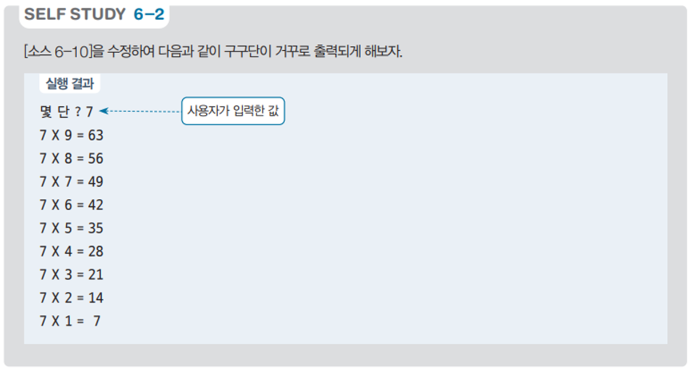

# 구구단 역순 출력 프로그램 - 특정 단 출력 예제

## 문제 설명

사용자가 입력한 숫자의 구구단을 9에서 1까지 역순으로 출력하는 C# 프로그램을 작성한다. 이 프로그램은 반복문을 활용하여 구구단을 계산하고 출력하는 연습에 유용하다.



## 코드 풀이

이 프로그램은 다음과 같은 이유로 작성되었다:

### 주요 코드 설명

- **구구단 역순 출력**
  - 사용자가 출력할 단을 입력받은 후, `for` 반복문을 사용하여 9부터 1까지 순회하면서 해당 단의 곱셈 결과를 출력한다. 역순으로 출력함으로써 반복문 사용에 대한 이해도를 높일 수 있다.

  ```csharp
  print.Write("몇 단 ? ");
  int num = Convert.ToInt32(read.ReadLine());

  for (int i = 9; i > 0; i--)
      print.WriteLine($"{num} X {i} = {num * i}");
  ```

## 정리

이 프로그램은 사용자가 입력한 단의 구구단을 역순으로 출력하는 예제이다. 반복문을 활용하여 구구단을 계산하고, 순서를 반대로 출력함으로써 반복문의 다양한 활용 방법을 연습하는 데 도움이 된다.