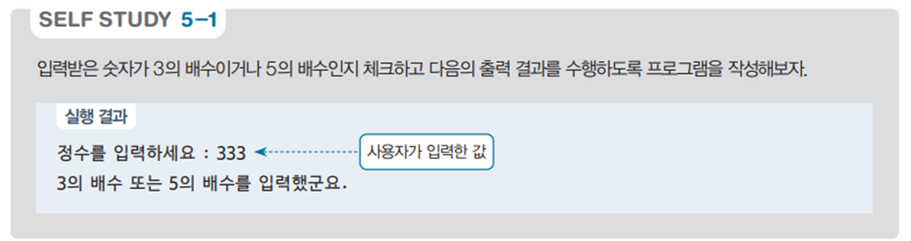

# 정수 확인 및 소수 판별 프로그램 - 배수 확인 및 소수 판별 예제

## 문제 설명

사용자가 입력한 정수가 3의 배수 또는 5의 배수인지 확인하고, (추가 문제)해당 정수가 소수인지 여부를 판단하여 결과를 출력하는 C# 프로그램을 작성한다.



## 코드 풀이

이 프로그램은 다음과 같은 이유로 작성되었다:

### 주요 코드 설명

- **3의 배수 또는 5의 배수 확인**
  - 사용자가 입력한 정수가 3의 배수이거나 5의 배수인 경우, "3의 배수 또는 5의 배수를 입력했군요."라는 메시지를 출력한다.

- **소수 판별**
  - **사용된 알고리즘: 에라토스테네스의 체 방식의 간소화된 버전**
    - 입력된 정수가 소수인지 판별하기 위해 2부터 입력값의 제곱근까지 반복하여 나누어 떨어지는지 확인하는 방법을 사용하였다. 이 알고리즘은 소수를 판별하는 효율적인 방법 중 하나로, 제곱근까지만 검사하면 소수 여부를 알 수 있다.
    - 만약 나누어 떨어지면 해당 정수는 소수가 아니며, 그렇지 않으면 소수로 판별한다. 소수의 경우 "소수입니다."라는 메시지를 출력하고, 소수가 아닌 경우 "소수가 아닙니다."라는 메시지를 출력한다.

  ```csharp
  print.Write("정수를 입력하세요 : ");
  int num = Convert.ToInt32(read.ReadLine());
  if (num % 5 == 0 || num % 3 == 0)
      print.WriteLine("3의 배수 또는 5의 배수를 입력했군요.");

  // 소수 찾기
  bool found = true;
  for (int i = 2; i <= Math.Sqrt(num); i++)
  {
      if (num % i == 0 || num <= 1)
      {
          found = false;
          print.Write("소수가 아닙니다.");
          break;
      }
  }

  if (found)
      print.Write("소수입니다.");
  ```

## 정리

이 프로그램은 사용자가 입력한 정수가 3의 배수 또는 5의 배수인지 확인하고, 해당 정수가 소수인지 여부를 판별하여 결과를 출력하는 예제이다. 조건문과 반복문을 활용하여 간단한 수학적 연산을 이해하고 연습하는 데 도움이 되는 프로그램이다. 소수 판별에는 제곱근까지의 반복을 통해 효율적으로 소수를 판별하는 알고리즘을 사용하였다.