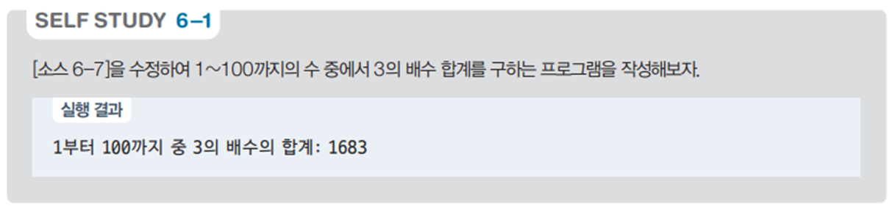

# 3의 배수 합계 계산 프로그램 - 1부터 100까지의 합계 예제

## 문제 설명

1부터 100까지의 숫자 중에서 3의 배수인 숫자들의 합계를 계산하여 출력하는 C# 프로그램을 작성한다. 이 프로그램은 기본적인 반복문과 조건문을 활용하여 특정 조건을 만족하는 값들의 합계를 계산하는 연습에 유용하다.



## 코드 풀이

이 프로그램은 다음과 같은 이유로 작성되었다:

### 주요 코드 설명

- **3의 배수 합계 계산**
  - 반복문 `for`를 사용하여 1부터 100까지의 숫자를 순회하면서 각 숫자가 3의 배수인지 검사한다. 만약 3의 배수라면 그 값을 `sum` 변수에 누적하여 합계를 계산한다.
  - 마지막으로, 계산된 합계를 출력하여 사용자가 확인할 수 있도록 한다.

  ```csharp
  int sum = 0;
  for (int i = 1; i <= 100; i++)
  {
      if (i % 3 == 0)
          sum += i;
  }

  print.Write($"1부터 100까지 중 3의 배수의 합계: {sum}");
  ```

이 알고리즘은 각 숫자를 순회하며 3의 배수를 찾는 단순한 방법으로, 시간 복잡도는 `O(n)`이다. 이는 각 숫자를 한 번씩 확인하는 구조로, 100개의 숫자를 순회하는 동안 3의 배수를 누적하여 합계를 계산한다.

## 정리

이 프로그램은 1부터 100까지의 숫자 중 3의 배수에 해당하는 숫자들의 합계를 계산하고, 그 결과를 출력하는 예제이다. 반복문과 조건문을 활용하여 특정 조건을 만족하는 값들을 합계하는 방법을 연습하는 데 유용하며, 기본적인 수학적 연산을 이해하는 데 도움이 되는 프로그램이다.