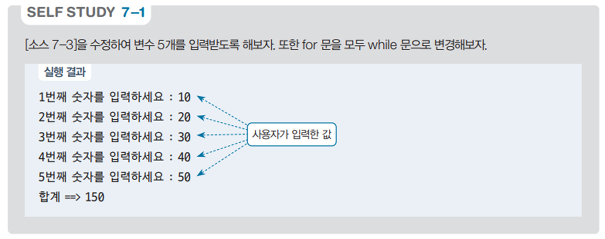

# 숫자 입력 합계 계산 프로그램 - 배열 사용 예제

## 문제 설명

사용자가 입력한 여러 개의 숫자를 배열에 저장하고, 그 숫자들의 합계를 계산하여 출력하는 C# 프로그램을 작성한다.



## 코드 풀이

이 프로그램은 다음과 같은 이유로 작성되었다:

### 주요 코드 설명

- **숫자 입력 횟수 지정**
  - 사용자가 몇 번 입력할지를 먼저 입력받고, 그 값을 통해 배열의 크기를 정한다. 이로써 사용자가 입력한 숫자를 저장할 배열이 만들어진다.

  ```csharp
  print.Write("몇 번 입력하시나요? : ");
  int size = Convert.ToInt32(read.ReadLine());

  int[] num = new int[size];
  ```

- **숫자 입력 및 배열 저장**
  - `while` 반복문을 사용하여 사용자가 입력한 숫자를 배열에 저장한다. `idx` 변수를 사용하여 현재 입력된 숫자의 인덱스를 관리한다.

  ```csharp
  int idx = 0;
  while (idx < size)
  {
      print.Write($"{idx + 1}번째 숫자를 입력하세요 : ");
      num[idx++] = Convert.ToInt32(read.ReadLine());
  }
  ```

- **배열의 합계 계산 및 출력**
  - `num.Sum()` 메서드를 사용하여 배열에 저장된 모든 숫자의 합계를 계산하고 출력한다.

  ```csharp
  print.Write($"합계 ==> {num.Sum()}");
  ```

## 정리

이 프로그램은 사용자가 입력한 여러 개의 숫자를 배열에 저장하고, 그 합계를 계산하여 출력하는 예제이다. 배열과 반복문을 활용하여 입력값을 처리하는 방법을 연습하고, 배열의 데이터를 효율적으로 다루는 데 도움이 된다.