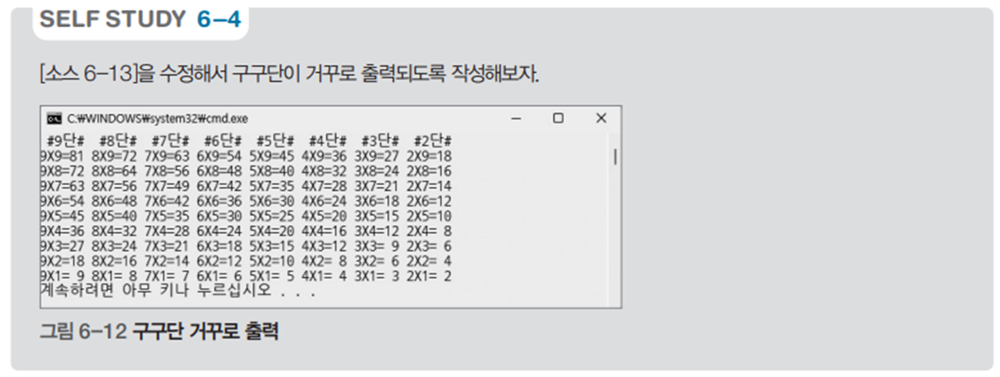

# 구구단 역순 전체 출력 프로그램 - 역순 구구단 예제

## 문제 설명

1부터 9까지의 구구단을 역순으로 출력하는 C# 프로그램을 작성한다.



## 코드 풀이

이 프로그램은 다음과 같은 이유로 작성되었다:

### 주요 코드 설명

- **구구단 역순 전체 출력**
  - 첫 번째 반복문을 사용하여 9단부터 1단까지의 타이틀을 출력한다. "#{단}단#" 형식으로 각 단을 구분하여 타이틀을 작성한다.
  - 두 번째 반복문에서는 각 단에 대해 9부터 1까지 곱한 결과를 출력한다. 모든 결과는 정렬된 형태로 표시되며, 각 곱셈 결과는 오른쪽으로 정렬하여 깔끔하게 출력한다.

  ```csharp
  for (int i = 9; i > 0; i--)
      print.Write($" #{i}단# ");

  print.WriteLine();

  for (int i = 9; i > 0; i--)
  {
      for (int j = 9; j > 0; j--)
          print.Write($"{j}X{i}={(j * i).ToString().PadLeft(2)} ");

      print.WriteLine();
  }
  ```

## 정리

이 프로그램은 9단부터 1단까지의 구구단을 역순으로 출력하는 예제이다. 반복문을 중첩하여 구구단의 모든 결과를 출력하며, 역순으로 출력함으로써 반복문 활용의 이해도를 높이고 출력 형식을 깔끔하게 맞추는 연습이 된다.