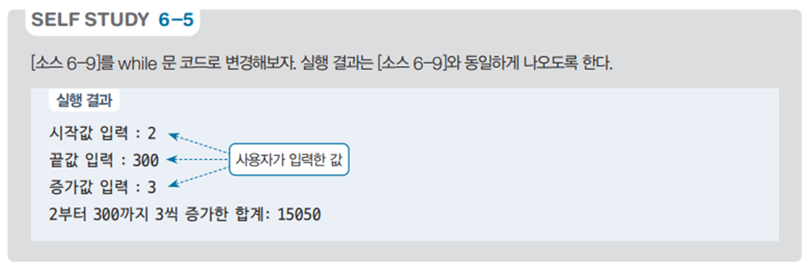

# 범위 내 증가값 합계 프로그램 - 구간 합계 계산 예제

## 문제 설명

사용자가 입력한 시작값, 끝값, 그리고 증가값을 이용하여 해당 범위 내에서 증가한 값들의 합계를 계산하는 C# 프로그램을 작성한다.



## 코드 풀이

이 프로그램은 다음과 같은 이유로 작성되었다:

### 주요 코드 설명

- **시작값, 끝값, 증가값 입력**
  - 사용자가 시작값, 끝값, 그리고 증가값을 입력받는다. 이러한 입력값을 기반으로 범위 내에서 증가하면서 값을 누적하여 합계를 구한다.

  ```csharp
  print.Write("시작값 입력: ");
  int startNum = Convert.ToInt32(read.ReadLine());
  
  print.Write("끝값 입력: ");
  int endNum = Convert.ToInt32(read.ReadLine());

  print.Write("증가값 입력: ");
  int increment = Convert.ToInt32(read.ReadLine());
  ```

- **범위 내 증가값 합계 계산**
  - `while` 반복문을 사용하여 시작값부터 끝값까지 증가값만큼 반복하면서 값을 누적한다. 합계를 `sum` 변수에 저장하고, 모든 반복이 끝난 후 합계를 출력한다.

  ```csharp
  int sum = 0;
  int i = startNum;
  while (i <= endNum)
  {
      sum += i;
      i += increment;
  }

  print.Write($"{startNum}부터 {endNum}까지 {increment}씩 증가한 합계: {sum}");
  ```

## 정리

이 프로그램은 사용자가 입력한 시작값, 끝값, 그리고 증가값에 따라 특정 범위 내의 모든 값들을 누적하여 합계를 구하는 예제이다. `while` 반복문을 사용하여 범위와 증가값을 지정하고, 조건에 맞는 합계를 구하는 방법을 연습할 수 있다.