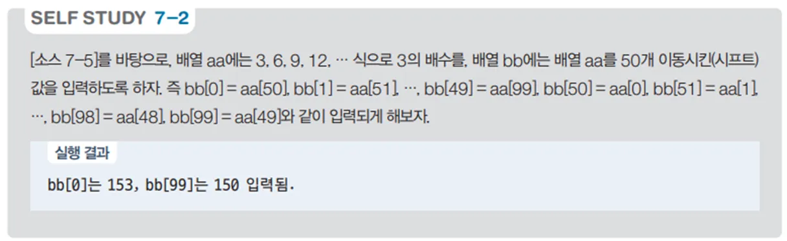

# 배열 값 복사 및 순환 프로그램 - 배열 사용 예제

## 문제 설명

100개의 값이 저장된 배열을 생성하고, 두 번째 배열에 첫 번째 배열의 값을 특정 규칙에 따라 복사하는 C# 프로그램을 작성한다.



## 코드 풀이

이 프로그램은 다음과 같은 이유로 작성되었다:

### 주요 코드 설명

- **배열 생성 및 값 할당**
  - `aa` 배열은 크기가 100인 정수 배열로, 각 요소는 `(i + 1) * 3`의 값을 저장한다. 즉, 3, 6, 9, ..., 300까지의 값이 저장된다.

  ```csharp
  int[] aa = new int[100];
  for (int i = 0; i < aa.Length; i++)
      aa[i] = (i + 1) * 3;
  ```

- **배열 값 복사 및 순환**
  - `bb` 배열 역시 크기가 100인 정수 배열이며, `aa` 배열의 값을 특정 규칙에 따라 복사한다. 복사 규칙은 `(i + 50) % aa.Length`로, 이는 `aa` 배열의 인덱스를 순환하여 `bb`에 값을 복사하는 역할을 한다. 즉, `aa`의 중간 지점부터 시작하여 배열의 끝까지 복사한 후, 다시 시작 지점으로 돌아가 남은 값을 복사한다.

  ```csharp
  int[] bb = new int[100];
  for (int i = 0; i < bb.Length; i++)
      bb[i] = aa[(i + 50) % aa.Length];
  ```

- **배열 값 출력**
  - `bb` 배열의 첫 번째 값과 마지막 값을 출력하여 배열이 제대로 복사되었는지 확인한다.

  ```csharp
  print.Write($"bb[0]는 {bb[0]}, bb[99]는 {bb[99]} 입력됨.");
  ```

## 정리

이 프로그램은 두 개의 배열을 사용하여 값을 복사하고, 인덱스를 순환하면서 데이터를 할당하는 예제이다. 배열의 순환적인 접근 방식을 통해 배열의 데이터를 복사하고 활용하는 방법을 연습할 수 있으며, 배열을 효과적으로 다루는 데 도움이 된다.