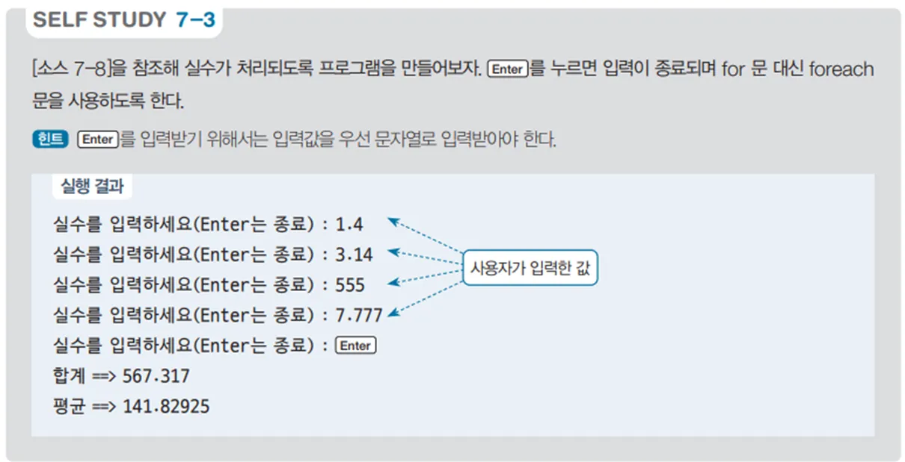

# 실수 합계 및 평균 계산 프로그램 - 실수 입력 예제

## 문제 설명

사용자가 실수를 입력받아 배열에 저장하고, 입력이 종료되면 입력된 실수들의 합계와 평균을 계산하여 출력하는 C# 프로그램을 작성한다. (단, **while**문을 사용해서 코드를 작성할 것)



## 코드 풀이

이 프로그램은 다음과 같은 이유로 작성되었다:

### 주요 코드 설명

- **실수 입력 및 배열 저장**
  - 사용자가 실수를 입력할 때마다 배열에 저장하고, 사용자가 엔터 키를 입력하거나 `0`을 입력하면 입력을 종료한다. 이를 통해 사용자가 원하는 만큼의 실수를 입력할 수 있도록 한다.

  ```csharp
  float[] nums = new float[100];
  int idx = 0;
  while (true)
  {
      print.Write("실수를 입력하세요(Enter는 종료) : ");
      string num = read.ReadLine();
      if (string.IsNullOrWhiteSpace(num) || num == "0")
          break;

      nums[idx++] = Convert.ToSingle(num);
  }
  ```

- **합계 및 평균 계산**
  - `nums` 배열에 저장된 값들의 합계를 계산하고, 평균을 출력한다. 평균을 계산할 때는 합계가 `0`보다 큰 경우에만 계산하도록 하여, 입력된 값이 없는 경우에도 오류가 발생하지 않도록 한다.

  ```csharp
  print.WriteLine($"합계 ==> {nums.Sum()}");
  print.WriteLine($"평균 ==> {(nums.Sum() > 0 ? nums.Sum() / idx : 0)}");
  ```

## 정리

이 프로그램은 사용자가 입력한 실수들을 배열에 저장하고, 그 합계와 평균을 계산하여 출력하는 예제이다. 배열과 반복문을 활용하여 입력값을 처리하고, 간단한 수학적 연산을 통해 합계와 평균을 계산하는 방법을 연습할 수 있다.