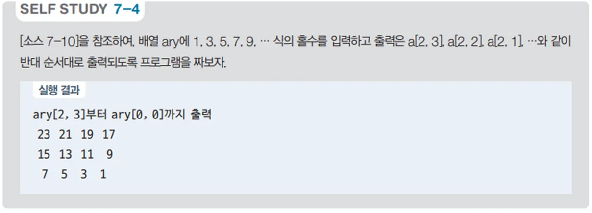

# 2차원 배열 값 출력 프로그램 - 배열 사용 예제

## 문제 설명

3행 4열의 2차원 배열을 생성하고, 배열에 홀수 값을 순차적으로 채운 후 역순으로 출력하는 C# 프로그램을 작성한다.



## 코드 풀이

이 프로그램은 다음과 같은 이유로 작성되었다:

### 주요 코드 설명

- **2차원 배열 생성 및 값 할당**
  - `ary`라는 3행 4열의 정수형 2차원 배열을 생성하고, `value`를 1부터 시작하여 배열의 각 요소에 홀수 값을 순차적으로 할당한다. 각 요소는 1, 3, 5, ...와 같은 홀수 값을 가진다.

  ```csharp
  int[,] ary = new int[3, 4];
  int value = 1;

  for (int i = 0; i < ary.GetLength(0); i++)
  {
      for (int j = 0; j < ary.GetLength(1); j++)
      {
          ary[i, j] = value;
          value += 2;
      }
  }
  ```

- **배열 역순 출력**
  - `for` 반복문을 사용하여 배열의 마지막 요소부터 첫 번째 요소까지 역순으로 출력한다. 이를 통해 배열의 요소를 역순으로 접근하는 방법을 연습할 수 있다.

  ```csharp
  print.WriteLine("ary[2, 3]부터 ary[0, 0]까지 출력");

  for (int i = ary.GetLength(0) - 1; i >= 0; i--)
  {
      for (int j = ary.GetLength(1) - 1; j >= 0; j--)
          print.Write($"{ary[i, j],3:D}");

      print.WriteLine();
  }
  ```

## 정리

이 프로그램은 3행 4열의 2차원 배열을 생성하고, 홀수 값을 채운 후 역순으로 출력하는 예제이다. 2차원 배열을 생성하고 데이터를 할당하는 과정, 그리고 배열을 역순으로 출력하는 방법을 연습할 수 있으며, 배열의 다양한 접근 방식을 이해하는 데 도움이 된다.