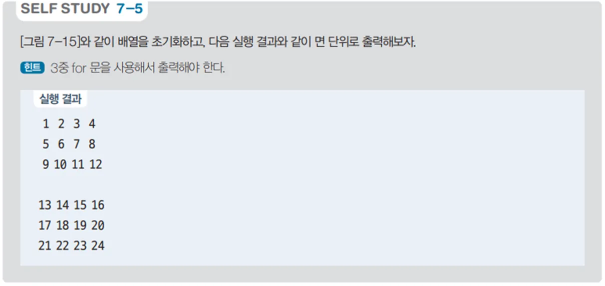

# 3차원 배열 값 출력 프로그램 - 배열 사용 예제

## 문제 설명

3행 4열 3면의 3차원 배열을 생성하고, 배열에 값을 순차적으로 채운 후 출력하는 C# 프로그램을 작성한다.



## 코드 풀이

이 프로그램은 다음과 같은 이유로 작성되었다:

### 주요 코드 설명

- **3차원 배열 생성 및 값 할당**
  - `ary`라는 3행 4열 3면의 정수형 3차원 배열을 생성하고, `value`를 1부터 시작하여 배열의 각 요소에 값을 순차적으로 할당한다. 각 면의 값은 순서대로 증가하며 채워진다.

  ```csharp
  int[,,] ary = new int[3, 4, 3]; // 행, 열, 면
  int value = 1;

  for (int depth = 0; depth < ary.GetLength(2); depth++)
  {
      for (int row = 0; row < ary.GetLength(0); row++)
      {
          for (int col = 0; col < ary.GetLength(1); col++)
          {
              ary[row, col, depth] = value++;
              print.Write($"{ary[row, col, depth],3:D}");
          }

          print.WriteLine();
      }

      print.WriteLine();
  }
  ```

- **3차원 배열 출력**
  - 각 면을 순차적으로 출력하기 위해 깊이(depth), 행(row), 열(col)을 반복문으로 순회한다. 각 면의 배열 요소를 출력하여 3차원 배열의 구조와 값을 확인할 수 있도록 한다.

## 정리

이 프로그램은 3행 4열 3면의 3차원 배열을 생성하고, 값을 채운 후 출력하는 예제이다. 3차원 배열을 생성하고 데이터를 할당하는 과정, 그리고 각 면을 순차적으로 출력하는 방법을 연습할 수 있으며, 배열의 다양한 접근 방식을 이해하는 데 도움이 된다.