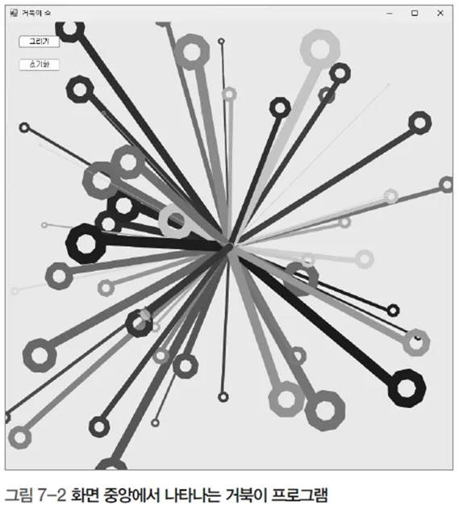

# 거북이 그래픽을 이용한 랜덤 드로잉 프로그램

## 문제 설명

거북이 그래픽을 사용하여 랜덤한 위치와 색상으로 선과 모양을 그리는 C# 프로그램을 작성한다.



## 코드 풀이

이 프로그램은 다음과 같은 이유로 작성되었다:

### 주요 코드 설명

- **초기 설정 및 화면 크기 조정**
  - `InitButton` 클릭 시, 거북이 그래픽의 초기 위치를 설정하고 화면 크기를 지정한다.

  ```csharp
  private void initButton_Click(object sender, EventArgs e)
  {
      Turtle.Init();
      Turtle.MoveTo(0, 0);
  }
  ```

- **랜덤 드로잉 설정**
  - `DrawButton` 클릭 시, 거북이 그래픽을 이용하여 랜덤한 위치와 색상으로 드로잉을 수행한다. 배열 `ary`는 각 드로잉의 위치, 선의 두께, 색상 등을 저장하며, 이를 기반으로 드로잉을 수행한다.

  ```csharp
  private void drawButton_Click(object sender, EventArgs e)
  {
      int swidth = 800;
      int sheight = 800;

      Text = "거북이 쇼";
      ClientSize = new Size(sheight, swidth);

      Turtle.Delay = 10;

      Random random = new Random();
      int size = random.Next(50, 100);
      int[,] ary = new int[size, 6];

      for (int i = 0; i < size; i++)
      {
          ary[i, 0] = random.Next(-swidth / 2, swidth / 2);
          ary[i, 1] = random.Next(-sheight / 2, sheight / 2);
          ary[i, 2] = random.Next(1, 20);
          ary[i, 3] = random.Next(0, 256);
          ary[i, 4] = random.Next(0, 256);
          ary[i, 5] = random.Next(0, 256);
      }

      for (int i = 0; i < size; i++)
      {
          Turtle.PenSize = ary[i, 2];
          Turtle.PenColor = Color.FromArgb(ary[i, 3], ary[i, 4], ary[i, 5]);
          Turtle.PenUp();
          Turtle.MoveTo(0, 0);
          Turtle.PenDown();
          Turtle.MoveTo(ary[i, 0], ary[i, 1]);

          int angle = (int)(Math.Atan2(ary[i, 0], ary[i, 1]) * 180 / Math.PI);
          Turtle.RotateTo(angle - 90);
          for (int k = 0; k < 9; k++)
          {
              Turtle.Forward(ary[i, 2]);
              Turtle.Rotate(40);
          }
      }
  }
  ```

- **드로잉 과정 설명**

  - 각 도형의 속성을 랜덤하게 생성하여 거북이를 이동시키고, 해당 위치에서 다양한 모양을 그리도록 한다. 도형의 위치와 크기, 색상 등이 무작위로 정해지기 때문에 사용자는 매번 새로운 패턴을 볼 수 있다.

  - 도형을 그릴 때 PenUp과 PenDown을 사용하여 이동과 그리기를 구분하며, 랜덤한 색상과 선의 두께를 사용한다.

  - 각 도형은 9개의 선으로 이루어져 있으며, 매번 40도씩 회전하면서 원형에 가까운 패턴을 그린다.

## 정리

이 프로그램은 거북이 그래픽을 이용하여 랜덤한 위치와 색상으로 선과 모양을 그리는 예제이다. `Random` 클래스를 이용하여 랜덤한 위치와 속성을 지정하고, 배열을 통해 각 도형의 위치와 속성을 저장하여 드로잉을 수행한다.
