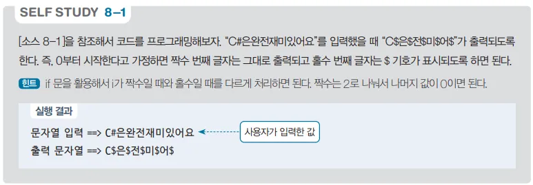

# 문자열 변환 프로그램 - 특정 인덱스 문자 대체 예제

## 문제 설명

입력받은 문자열에서 홀수 인덱스에 위치한 문자들을 '$'로 변경하는 C# 프로그램을 작성한다.



## 코드 풀이

이 프로그램은 다음과 같은 방식으로 구성된다:

### 주요 코드 설명

- **문자열 변환 함수 `Change`**
  - `Change` 함수는 입력받은 문자열에서 홀수 인덱스에 해당하는 문자를 '$'로 변경한다.
  - `for` 반복문을 사용하여 문자열을 순회하고, 홀수 인덱스일 경우 '$'를, 그렇지 않을 경우 해당 문자를 결과 문자열에 추가한다.

  ```csharp
  static string Change(string str)
  {
      string resultStr = null;
      for (int i = 0; i < str.Length; i++)
          resultStr += (i % 2 != 0) ? '$' : str[i];

      return resultStr;
  }
  ```

- **입출력 설정 및 변환 결과 출력**
  - 콘솔 입출력 인코딩을 UTF-8로 설정하여 다양한 문자 입력을 지원한다.

  ```csharp
  public static void Main()
  {
      #region I/O
      // 콘솔의 입출력 인코딩을 UTF-8로 설정
      Console.InputEncoding = Encoding.UTF8;
      Console.OutputEncoding = Encoding.UTF8;

      using var read = new System.IO.StreamReader(Console.OpenStandardInput());
      using var print = new System.IO.StreamWriter(Console.OpenStandardOutput()) { AutoFlush = true };
      #endregion
      
      Console.Write("문자열 입력 ==> ");
      string str = read.ReadLine();
      Console.Write($"출력 문자열 ==> {Change(str)}");
  }
  ```

## 정리

이 프로그램은 사용자가 입력한 문자열에서 홀수 인덱스에 위치한 문자를 '$'로 변경하여 출력하는 예제이다. 이를 통해 문자열의 특정 인덱스에 대한 접근 및 수정 방법을 연습할 수 있다.

