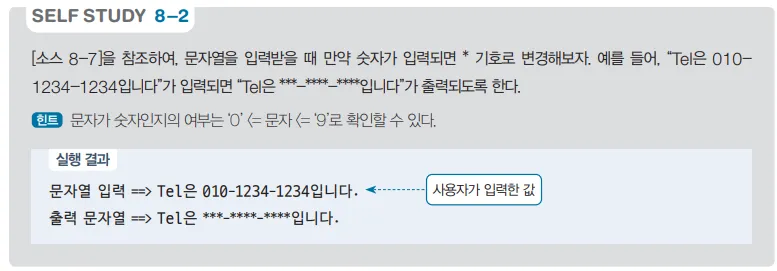

# 문자열 변환 프로그램 - 숫자 마스킹 예제

## 문제 설명

사용자가 입력한 문자열에서 숫자를 `*`로 대체하는 C# 프로그램을 작성한다.



## 코드 풀이

### 주요 코드 설명

- **Change 메서드**
  - `Change` 메서드는 문자열 내 숫자를 `*`로 바꾸는 기능을 한다. 입력 문자열을 순회하며 각 문자가 숫자인지 확인하고, 숫자라면 `*`로 대체하고 그렇지 않다면 원래 문자를 유지한다.

  ```csharp
  static string Change(string str)
  {
      string resultStr = null;
      foreach (char ch in str)
          resultStr += (ch >= '0' && ch <= '9') ? '*' : ch;

      return resultStr;
  }
  ```

- **Main 메서드**
  - UTF-8 인코딩을 설정하여 다양한 문자를 입출력할 수 있도록 한다.

  ```csharp
  public static void Main()
  {
      Console.InputEncoding = Encoding.UTF8;
      Console.OutputEncoding = Encoding.UTF8;

      using var read = new System.IO.StreamReader(Console.OpenStandardInput());
      using var print = new System.IO.StreamWriter(Console.OpenStandardOutput()) { AutoFlush = true };

      print.Write("문자열 입력 ==> ");
      string str = read.ReadLine();
      print.Write($"출력 문자열 ==> {Change(str)}");
  }
  ```

### 입력 및 출력 예제

- **입력 예시**  
  ```
  문자열 입력 ==> abc123def
  ```
- **출력 예시**  
  ```
  출력 문자열 ==> abc***def
  ```

## 정리

이 프로그램은 문자열 내 숫자를 `*`로 마스킹하여 출력하는 기능을 제공한다. 특정 문자를 찾아 대체하는 연습과 UTF-8 인코딩 설정 방법을 학습하는 데 유용한 예제이다.