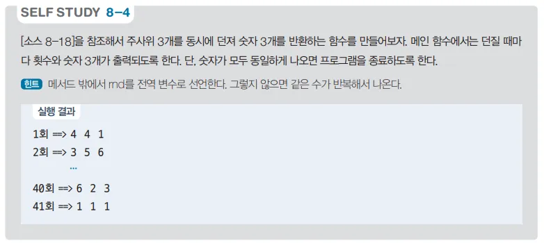

# 주사위 게임 프로그램 - 동일한 숫자 찾기

## 문제 설명

세 개의 주사위를 굴려 세 주사위의 값이 모두 같아질 때까지 반복하는 C# 프로그램을 작성한다. 이 프로그램은 난수를 통해 주사위 값을 생성하고, 시도 횟수와 주사위의 결과를 반복 출력하는 방식으로 진행된다.



## 코드 풀이

### 주요 코드 설명

- **SetDice 메서드**
  - `SetDice` 메서드는 `Random` 클래스를 사용해 주사위 3개의 값을 1에서 6 사이의 난수로 설정한다. 배열에 주사위 값을 저장하여 반환하며, 각 주사위는 독립적으로 난수를 생성해 값이 달라질 수 있다.

  ```csharp
  static int[] SetDice()
  {
      Random random = new Random();
      int[] dice = new int[3];

      for (int i = 0; i < dice.Length; i++)
          dice[i] = random.Next(1, 7);

      return dice;
  }
  ```

- **Main 메서드**
  - UTF-8 인코딩 설정을 통해 입출력 처리를 한다.

  ```csharp
  public static void Main()
  {
      Console.InputEncoding = Encoding.UTF8;
      Console.OutputEncoding = Encoding.UTF8;

      using var read = new System.IO.StreamReader(Console.OpenStandardInput());
      using var print = new System.IO.StreamWriter(Console.OpenStandardOutput()) { AutoFlush = true };

      int count = 1;
      while (true)
      {
          int[] dice = SetDice();
          print.WriteLine($"{count++}회 ==> {dice[0]} {dice[1]} {dice[2]}");

          if (dice[0] == dice[1] && dice[1] == dice[2])
              break;
      }
  }
  ```

### 실행 예제

- **출력 예시**  
  ```
  1회 ==> 3 5 2
  2회 ==> 4 6 1
  3회 ==> 6 6 6
  ```

  위 예시에서는 3회차에 세 주사위 값이 모두 6으로 일치하여 반복이 종료된다.

## 정리

이 프로그램은 세 개의 주사위를 굴려 값이 모두 같아질 때까지 반복하여 출력하는 기능을 수행한다. 주사위 값 생성과 비교 과정을 통해 반복 구조와 난수 생성에 대해 학습할 수 있는 예제이다.