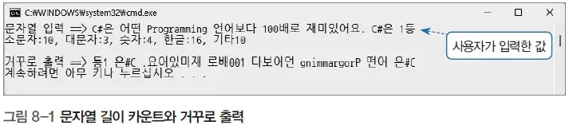

# 문자열 길이 카운트 및 역순 출력

## 문제 설명

입력받은 문자열을 분석하여 소문자, 대문자, 숫자, 한글, 기타 문자의 개수를 각각 출력하고, 해당 문자열을 거꾸로 출력하는 프로그램을 작성한다.



## 코드 풀이

### 주요 코드 설명

- **문자열 분석**
  - `foreach` 루프를 사용하여 문자열의 각 문자를 검사한다.
  - 각 문자의 속성을 확인하기 위해 다음 메서드 및 조건을 사용한다:
    - `char.IsLower(c)`: 소문자인지 확인한다.
    - `char.IsUpper(c)`: 대문자인지 확인한다.
    - `char.IsNumber(c)`: 숫자인지 확인한다.
    - `0xAC00 <= c && c <= 0xD7A3`: 한글 글자 여부를 확인한다.
    - 기타 문자로 분류되지 않은 나머지는 `count`로 집계한다.

  ```csharp
  foreach (var c in str)
  {
      if (char.IsLower(c))
          lowerCount++;
      else if (char.IsUpper(c))
          upperCount++;
      else if (char.IsNumber(c))
          numCount++;
      else if ((0xAC00 <= c && c <= 0xD7A3) || (0x3131 <= c && c <= 0x318E))
          koreanCount++;
      else
          count++;
  }
  ```

- **거꾸로 출력**
  - 문자열을 거꾸로 출력하기 위해 LINQ의 `Reverse` 메서드와 `ToArray`를 사용한다.
  - `new string(str.Reverse().ToArray())`를 통해 문자열의 역순을 생성한다.

  ```csharp
  print.Write($"거꾸로 출력 ==> {new string(str.Reverse().ToArray())}");
  ```

### 실행 예제

- **입력 예시**  
  ```
  문자열 입력 ==> Hello123안녕!
  ```
- **출력 예시**  
  ```
  소문자:4, 대문자:1, 숫자:3, 한글:2, 기타:1
  거꾸로 출력 ==> !녕안321olleH
  ```

## 정리

이 프로그램은 문자열의 각 문자 속성을 분석하여 소문자, 대문자, 숫자, 한글, 기타 문자 수를 집계하고, 문자열을 거꾸로 출력한다. 문자열 분석과 역순 출력 구현을 통해 문자열 처리 및 조건문 사용을 학습하는 데 유용한 예제다.