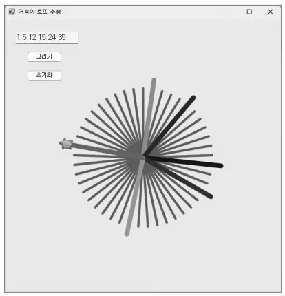

# 거북이를 사용한 로또 번호 추첨 프로그램

## 문제 설명

거북이 그래픽을 활용하여 로또 번호를 랜덤하게 추첨하고 이를 화면에 시각적으로 표시하는 C# 프로그램이다. 이 프로그램은 `Nakov.TurtleGraphics` 라이브러리를 사용하며, 추첨된 번호를 텍스트로 출력하는 동시에 거북이 그래픽으로 시각화한다.



## 코드 풀이

### 주요 기능 설명

1. **로또 번호 생성**
   - `GetLotto` 메서드는 1부터 45까지의 숫자 중 6개의 랜덤 번호를 생성한다. 중복을 방지하기 위해 `IsNumInArray` 메서드를 사용하여 이미 선택된 번호인지 확인한다.
   - 번호는 오름차순으로 정렬되어 텍스트 상자에 표시된다.

   ```csharp
   static void GetLotto(int[] ary)
   {
       int idx = 0;
       int pickNum;

       while (true)
       {
           pickNum = _random.Next(1, 45);
           if (IsNumInArray(ary, pickNum))
               continue;
           ary[idx] = pickNum;
           if (idx >= 5)
               break;
           idx++;
       }
   }
   ```

2. **시각화**
   - 거북이 그래픽은 기본적으로 45개의 회전된 회색 선을 그린다. 각 선은 로또 번호와 동일한 각도에서 위치하도록 설정된다.
   - 추첨된 번호는 랜덤한 색상의 굵은 선으로 표시된다.

   ```csharp
   for (int i = 0; i < lotto.Length; i++)
   {
       int R = _random.Next(0, 256);
       int G = _random.Next(0, 256);
       int B = _random.Next(0, 256);

       Turtle.PenColor = Color.FromArgb(R, G, B);
       Turtle.PenUp();
       Turtle.MoveTo(0, 0);
       Turtle.PenDown();
       Turtle.RotateTo(lotto[i] * 8);
       Turtle.Forward(170);
   }
   ```

3. **초기화 및 설정**
   - `initButton`은 Turtle을 초기화하여 새 작업을 시작할 준비를 한다.
   - `drawButton`은 추첨 프로세스와 시각화를 실행한다.

### 실행 예제

1. **프로그램 실행**
   - "Draw" 버튼을 클릭하면 로또 번호가 추첨된다.
   - 결과는 텍스트 박스에 출력되고, 거북이가 화면에 시각적으로 표시한다.

2. **결과 화면**
   - 로또 번호: `1 9 23 27 35 44`
   - 그래픽: 거북이가 회전하며 추첨된 번호에 해당하는 각도에 랜덤 색상의 선을 그림.

### 주요 코드 구조

- **랜덤 번호 생성**: `GetLotto`
- **중복 확인**: `IsNumInArray`
- **그래픽 초기화**: `Turtle.Init`
- **시각화**: `Turtle` 객체의 `RotateTo`와 `Forward` 메서드 사용

## 정리

이 프로그램은 Nakov.TurtleGraphics를 사용해 로또 번호를 랜덤으로 생성하고, 추첨 결과를 그래픽으로 표시하는 기능을 수행한다. 사용자 인터페이스는 Windows Forms로 구현되었으며, 프로그래밍적 로직과 시각적 표현을 결합한 흥미로운 예제다.