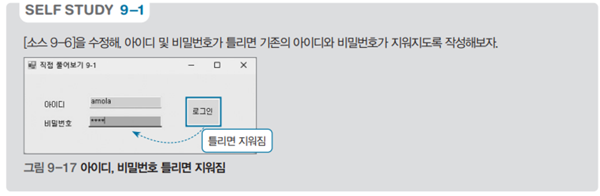

# 간단한 로그인 프로그램

## 문제 설명

사용자가 입력한 아이디와 비밀번호를 확인하여 로그인 여부를 판단하는 Windows Forms 기반의 프로그램이다. 아이디와 비밀번호가 정확하면 환영 메시지를 출력하고 창을 닫으며, 그렇지 않으면 오류 메시지를 출력한다.



## 코드 풀이

### 주요 기능 설명

1. **로그인 버튼 클릭 이벤트**
   - `loginButton_Click` 메서드는 로그인 버튼이 클릭되었을 때 실행된다.
   - 입력 필드가 비어 있으면 경고 메시지를 출력한다.
   - 아이디와 비밀번호가 `hanbit`과 `css`로 정확히 일치하면 환영 메시지를 출력하고 창을 닫는다.
   - 잘못된 정보가 입력되었을 경우, 입력 필드를 초기화하고 오류 메시지를 출력한다.

   ```csharp
   private void loginButton_Click(object sender, EventArgs e)
   {
       if (idTextBox.Text == "" || passwordTextBox.Text == "")
           MessageBox.Show("아이디와 비밀번호를 입력하세요.");
       else if (idTextBox.Text == "hanbit" && passwordTextBox.Text == "css")
       {
           MessageBox.Show($"{idTextBox.Text}님 어서오세요~ 지금 창을 닫습니다.");
           Close();
       }
       else
       {
           idTextBox.Text = "";
           passwordTextBox.Text = ""; 
           MessageBox.Show("아이디와 비밀번호를 다시 확인하세요.");
       }
   }
   ```

### 실행 예제

1. **올바른 로그인**
   - 입력:
     ```
     아이디: hanbit
     비밀번호: css
     ```
   - 출력:
     ```
     hanbit님 어서오세요~ 지금 창을 닫습니다.
     ```

2. **입력 값 누락**
   - 입력:
     ```
     아이디: (비어 있음)
     비밀번호: css
     ```
   - 출력:
     ```
     아이디와 비밀번호를 입력하세요.
     ```

3. **잘못된 로그인**
   - 입력:
     ```
     아이디: test
     비밀번호: 1234
     ```
   - 출력:
     ```
     아이디와 비밀번호를 다시 확인하세요.
     ```

### 주요 코드 구조

- **입력 검증**: `idTextBox.Text == "" || passwordTextBox.Text == ""`
- **로그인 성공 조건**: `idTextBox.Text == "hanbit" && passwordTextBox.Text == "css"`
- **입력 필드 초기화**: `idTextBox.Text = ""; passwordTextBox.Text = "";`

## 정리

이 프로그램은 간단한 Windows Forms 기반 로그인 기능을 구현한다. 사용자 입력을 검증하고 적절한 메시지를 출력하며, 잘못된 입력이 있을 경우 입력 필드를 초기화한다. 로그인 기능의 기본 동작을 이해하고 이벤트 처리와 입력 검증에 대해 학습할 수 있는 좋은 예제다.