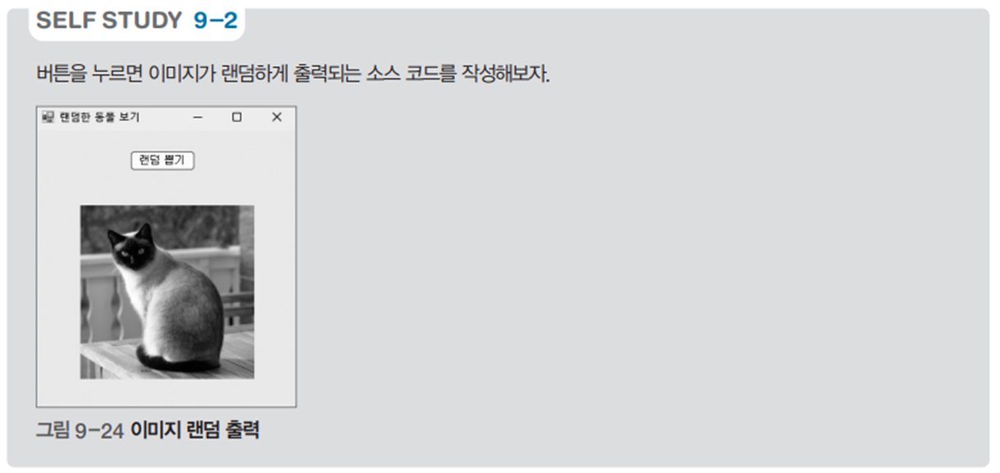

# 랜덤 동물 이미지 뷰어

## 문제 설명

`Hollow Knight` 게임의 캐릭터 목록에서 랜덤으로 캐릭터를 선택하고, 해당 캐릭터 이미지를 표시하는 Windows Forms 기반의 프로그램이다. 버튼 클릭 시 랜덤으로 캐릭터를 선택하여 이미지를 보여준다.



## 코드 풀이

### 주요 기능 설명

1. **캐릭터 리스트 초기화**
   - 폼 로드 시 `_hollowKnight` 리스트에 캐릭터 이름을 추가한다.
   - 리스트에 포함된 캐릭터의 이름과 동일한 이름의 이미지 파일이 프로그램 실행 디렉토리의 `Images` 폴더에 있어야 한다.

   ```csharp
   private void Form1_Load(object sender, EventArgs e)
   {
       animalPictureBox.SizeMode = PictureBoxSizeMode.StretchImage;
       _hollowKnight = new List<string>()
       {
           "Knight",
           "Hornet",
           "Quirrel",
       };
   }
   ```

2. **랜덤 이미지 선택 및 표시**
   - `drawRandomAnimalButton_Click` 메서드는 버튼 클릭 이벤트를 처리한다.
   - `Random` 객체를 사용해 `_hollowKnight` 리스트에서 랜덤한 인덱스를 선택한다.
   - 선택된 캐릭터 이름과 동일한 이름의 PNG 파일을 `Images` 폴더에서 찾아 `animalPictureBox`에 로드한다.

   ```csharp
   private void drawRandomAnimalButton_Click(object sender, EventArgs e)
   {
       Random random = new Random();
       int idx = random.Next(0, _hollowKnight.Count);

       string basePath = Path.Combine(Environment.CurrentDirectory, "Images");
       string imageFile = Path.Combine(basePath, $"{_hollowKnight[idx]}.png");
       animalPictureBox.Image = Image.FromFile(imageFile);
   }
   ```

3. **이미지 표시**
   - 이미지는 `PictureBox` 컨트롤을 사용하여 화면에 표시되며, 크기는 `StretchImage`로 설정해 컨트롤 크기에 맞게 조정된다.

### 실행 예제

1. **초기 상태**
   - 프로그램 실행 시 `Images` 폴더에 저장된 이미지가 준비되어 있어야 한다.
   - 캐릭터 이름은 `_hollowKnight` 리스트와 일치해야 한다.

2. **버튼 클릭 동작**
   - 버튼 클릭 시 랜덤으로 선택된 캐릭터의 이미지를 화면에 표시한다.
   - 예: 리스트에 `"Knight"`, `"Hornet"`, `"Quirrel"`이 있다면 `Images` 폴더에 `Knight.png`, `Hornet.png`, `Quirrel.png` 파일이 있어야 한다.

### 주요 코드 구조

- **리스트 초기화**: `Form1_Load` 메서드에서 `_hollowKnight` 리스트에 캐릭터 이름 추가.
- **랜덤 선택**: `Random` 객체를 사용해 리스트에서 랜덤한 인덱스 선택.
- **이미지 로드**: 선택된 이름의 PNG 파일을 `Images` 폴더에서 찾아 `PictureBox`에 표시.

## 정리

이 프로그램은 랜덤으로 캐릭터 이미지를 표시하는 간단한 응용 프로그램이다. 캐릭터 이름 리스트와 이미지 파일이 연동되며, 버튼 클릭 이벤트로 랜덤 캐릭터를 시각적으로 확인할 수 있다. 리스트와 파일 시스템의 연계를 이해하고, 랜덤 데이터 선택과 이미지 로드 방법을 학습하는 데 유용하다.