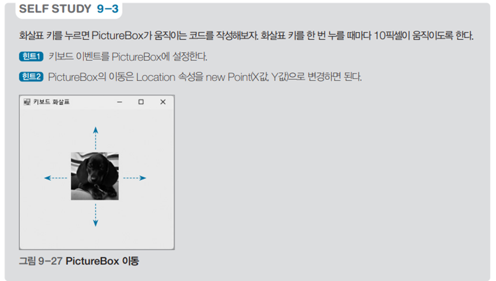

# 화살표 키 입력을 통한 이미지 이동 프로그램

## 문제 설명

사용자가 키보드 방향키(화살표 키)를 사용하여 화면 상의 이미지를 상하좌우로 이동시키는 Windows Forms 프로그램이다. 화살표 키 입력 이벤트를 처리하여 `PictureBox`의 위치를 변경하는 방식으로 동작한다.



## 코드 풀이

### 주요 기능 설명

1. **키 입력 이벤트 처리**
   - `Form1_KeyDown` 메서드는 키보드 입력 이벤트를 처리한다.
   - 방향키를 입력하면 현재 `PictureBox`의 위치를 기준으로 이동 방향에 따라 새로운 위치를 계산한다.
   - 계산된 위치를 `PictureBox.Location`에 설정하여 이미지의 위치를 변경한다.

   ```csharp
   private void Form1_KeyDown(object sender, KeyEventArgs e)
   {
       Point point;

       switch (e.KeyCode)
       {
           case Keys.Up:
               point = new Point(pictureBox.Location.X, pictureBox.Location.Y - 10);
               break;
           case Keys.Down:
               point = new Point(pictureBox.Location.X, pictureBox.Location.Y + 10);
               break;
           case Keys.Left:
               point = new Point(pictureBox.Location.X - 10, pictureBox.Location.Y);
               break;
           case Keys.Right:
               point = new Point(pictureBox.Location.X + 10, pictureBox.Location.Y);
               break;
           default:
               return;
       }

       pictureBox.Location = point;
   }
   ```

2. **폼의 키 입력 활성화**
   - 키 입력 이벤트를 활성화하려면 폼의 `KeyPreview` 속성을 `true`로 설정해야 한다. 이 설정을 통해 폼에서 키 입력 이벤트를 우선 처리할 수 있다.

3. **이동 거리**
   - 각 방향키 입력에 따라 `PictureBox`는 10픽셀씩 이동한다. 이동 거리 조정을 위해 `Point` 객체를 사용하여 X와 Y 좌표를 계산한다.

### 실행 예제

1. **위쪽 화살표 키 입력**
   - 동작: `PictureBox`가 위쪽으로 10픽셀 이동.
   - 위치 변경 전: (100, 100)  
   - 위치 변경 후: (100, 90)

2. **왼쪽 화살표 키 입력**
   - 동작: `PictureBox`가 왼쪽으로 10픽셀 이동.
   - 위치 변경 전: (100, 100)  
   - 위치 변경 후: (90, 100)

3. **다른 키 입력**
   - 동작: `PictureBox`의 위치는 변경되지 않음.

### 주요 코드 구조

- **이동 처리**: `Point` 객체를 사용하여 X와 Y 좌표를 업데이트.
- **키 입력 확인**: `switch` 문을 사용해 입력된 키를 분기 처리.
- **화면 상호작용**: `pictureBox.Location` 속성을 업데이트하여 시각적으로 이동 반영.

## 정리

이 프로그램은 키보드 방향키 입력을 통해 화면의 이미지를 이동시키는 간단한 이벤트 처리와 사용자 상호작용 예제를 제공한다. 이벤트 기반 프로그래밍과 Windows Forms의 컨트롤 속성 변경을 학습하는 데 적합한 예제다.