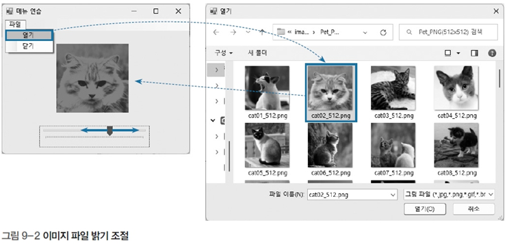

# 이미지 밝기 조정 프로그램

## 문제 설명

이 프로그램은 사용자가 트랙바를 움직여 이미지의 밝기를 조정할 수 있도록 구현된 Windows Forms 응용 프로그램이다. 밝기 조정 값은 트랙바의 위치에 따라 설정되며, `PictureBox`에 표시된 이미지의 밝기를 실시간으로 조정한다.



## 코드 풀이

### 주요 기능 설명

1. **트랙바 이벤트 처리**
   - `trackBar_Scroll` 이벤트가 호출될 때마다 이미지의 각 픽셀에 대해 밝기 값을 조정한다.
   - 밝기 조정 값은 트랙바의 `Value` 속성으로 설정되며, RGB 각 채널 값에 추가되거나 감소된다.

   ```csharp
   private void trackBar_Scroll(object sender, EventArgs e)
   {
       Bitmap bmp = new Bitmap(pictureBox.Image);
       int R, G, B;
       Color color;

       for (int i = 0; i < bmp.Height; i++)
       {
           for (int j = 0; j < bmp.Width; j++)
           {
               color = bmp.GetPixel(j, i);
               R = color.R + trackBar.Value;
               G = color.G + trackBar.Value;
               B = color.B + trackBar.Value;

               if (R > 255)
                   R = 255;
               else if (R < 0)
                   R = 0;

               if (G > 255)
                   G = 255;
               else if (G < 0)
                   G = 0;

               if (B > 255)
                   B = 255;
               else if (B < 0)
                   B = 0;

               color = Color.FromArgb(R, G, B);
               bmp.SetPixel(j, i, color);
           }
       }

       pictureBox.Image = bmp;
   }
   ```

2. **밝기 제한**
   - RGB 값은 0에서 255 사이로 제한된다. 이를 통해 색상 값이 유효한 범위를 벗어나지 않도록 한다.
   - 조정된 밝기가 255를 초과하거나 0 미만이 되는 경우 각각 255와 0으로 설정한다.

3. **실시간 이미지 업데이트**
   - 트랙바의 값이 변경될 때마다 새로 계산된 픽셀 값을 적용한 이미지를 `PictureBox`에 표시한다.

### 실행 예제

1. **이미지 로드**
   - `PictureBox`에 기본 이미지를 로드한다.

2. **트랙바 조작**
   - 사용자가 트랙바를 오른쪽으로 이동하면 이미지 밝기가 증가한다.
   - 트랙바를 왼쪽으로 이동하면 이미지 밝기가 감소한다.

3. **밝기 조정 결과**
   - 밝기 조정 후, 이미지가 실시간으로 업데이트되어 새로운 밝기로 표시된다.

### 주요 코드 구조

- **밝기 조정**: `trackBar.Value`를 기반으로 RGB 값을 계산하고, `Color.FromArgb`로 새로운 색상을 생성.
- **픽셀 변경**: `Bitmap.GetPixel`과 `Bitmap.SetPixel`을 사용하여 이미지의 각 픽셀을 조정.
- **이미지 업데이트**: 조정된 이미지를 `PictureBox.Image`에 설정.

## 정리

이 프로그램은 간단한 이미지 처리 기능을 구현하며, 사용자가 밝기를 조정하여 이미지의 변화를 실시간으로 확인할 수 있다. Windows Forms의 `TrackBar`와 `PictureBox`를 활용하여 사용자 인터페이스와 이벤트 처리를 학습할 수 있는 예제다.