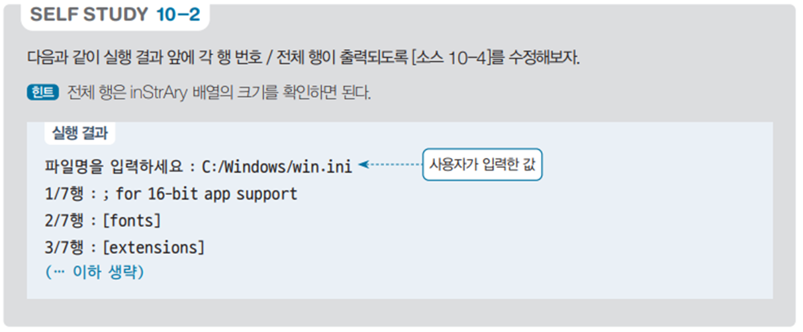

# 파일 행 번호 출력 프로그램

## 문제 설명

사용자가 지정한 파일의 내용을 읽어 각 행의 내용을 출력하는 프로그램이다. 출력 시 각 행 번호와 전체 행 개수를 함께 표시하여 가독성을 높인다.



## 코드 풀이

### 주요 기능 설명

1. **입출력 설정**
   - UTF-8 인코딩을 설정하여 파일 및 콘솔 입출력을 처리한다.
   - `Console.InputEncoding`과 `Console.OutputEncoding`을 UTF-8로 설정하여 다국어 입력과 출력에 대응한다.

   ```csharp
   #region I/O
   Console.InputEncoding = Encoding.UTF8;
   Console.OutputEncoding = Encoding.UTF8;

   using var read = new System.IO.StreamReader(Console.OpenStandardInput());
   using var print = new System.IO.StreamWriter(Console.OpenStandardOutput()) { AutoFlush = true };
   #endregion
   ```

2. **파일 읽기**
   - 사용자로부터 파일 경로를 입력받는다.
   - `File.ReadAllLines` 메서드를 사용하여 파일의 모든 줄을 읽고 문자열 배열로 저장한다.

   ```csharp
   print.Write("파일명을 입력하세요 : ");
   string fileName = read.ReadLine();  // 예: C:/Windows/win.ini
   var inStrAry = File.ReadAllLines(fileName);
   ```

3. **행 번호와 내용 출력**
   - 파일 내용은 `foreach` 루프를 사용하여 한 줄씩 처리된다.
   - 출력 시 현재 행 번호와 전체 행 개수를 함께 출력하여 사용자에게 현재 진행 상황을 제공한다.

   ```csharp
   int row = 1;
   foreach (string inStr in inStrAry)
       print.WriteLine($"{row++}/{inStrAry.Length}행 : {inStr}");
   ```

### 실행 예제

1. **입력**
   - 입력:  
     ```
     파일명을 입력하세요 : C:/Windows/win.ini
     ```

2. **출력**
   - 출력 예시:  
     ```
     1/10행 : ; for 16-bit app support
     2/10행 : [fonts]
     3/10행 : ; comment line
     ...
     ```

## 정리

이 프로그램은 파일 내용을 행 번호와 함께 출력하여 파일 구조를 쉽게 이해할 수 있도록 돕는다. 파일 입출력, 배열 처리, 문자열 출력 등의 기본적인 작업을 연습하는 데 유용하다.