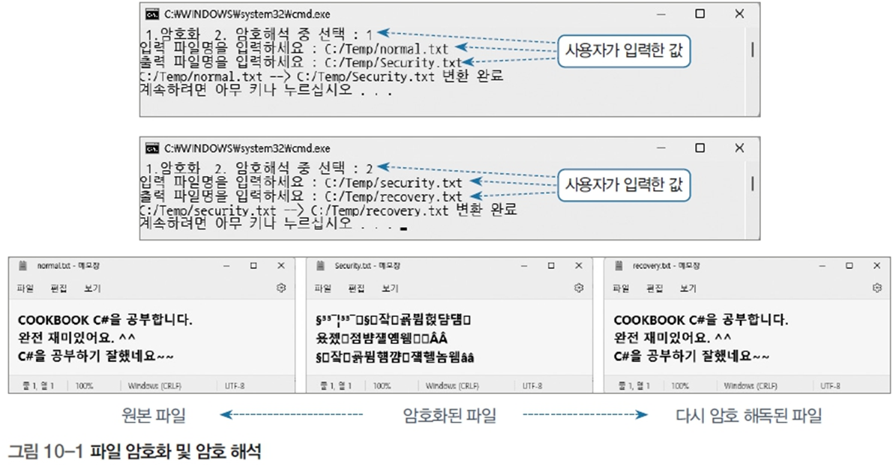

# 파일 암호화 및 복호화 프로그램

## 문제 설명

이 프로그램은 텍스트 파일의 내용을 암호화하거나 복호화하는 기능을 제공한다. 사용자는 입력 파일과 출력 파일을 지정하고, 암호화 또는 복호화를 선택할 수 있다. 텍스트의 각 문자는 ASCII 코드 값을 기준으로 변환된다.



## 코드 풀이

### 주요 기능 설명

1. **입출력 설정**
   - `Console.InputEncoding`과 `Console.OutputEncoding`을 UTF-8로 설정하여 다국어 문자의 처리를 지원한다.
   - 입력 및 출력 파일의 경로는 현재 디렉토리의 `Resources` 폴더를 기준으로 설정된다.

   ```csharp
   string basePath = Path.Combine(Environment.CurrentDirectory, "Resources");
   ```

2. **암호화/복호화 선택**
   - 사용자가 `1`을 입력하면 암호화(+100), `2`를 입력하면 복호화(-100) 값을 설정한다.

   ```csharp
   print.Write("1.암호화 2.암호해석 중 선택 : ");
   int secu = Convert.ToInt32(read.ReadLine());

   if (secu == 1)
       secu = 100;
   else if (secu == 2)
       secu = -100;
   ```

3. **파일 처리**
   - 입력 파일의 각 줄을 읽어서 문자 하나씩 변환 후 출력 파일에 저장한다.
   - 변환 로직:
     - 문자 → ASCII 코드 → 변환 → 새 문자로 변환
   - 각 문자의 ASCII 코드 값에 `secu` 값을 더하거나 빼서 변환한다.

   ```csharp
   while (true)
   {
       inStr = inFp.ReadLine();
       if (inStr == null)
           break;

       outStr = "";
       foreach (char ch in inStr)
       {
           int chNum = (int)ch;
           chNum += secu;

           char newCh = (char)chNum;
           outStr += newCh;
       }

       outFp.WriteLine(outStr);
   }
   ```

4. **변환 결과**
   - 변환이 완료되면 입력 파일과 출력 파일의 경로를 출력한다.

   ```csharp
   print.Write($"{inputFileName} -> {outputFileName} 변환 완료");
   ```

### 실행 예제

1. **암호화**
   - 입력:  
     ```
     1.암호화 2.암호해석 중 선택 : 1
     입력 파일명을 입력하세요 : Normal.txt
     출력 파일명을 입력하세요 : Security.txt
     ```

2. **복호화**
   - 입력:  
     ```
     1.암호화 2.암호해석 중 선택 : 2
     입력 파일명을 입력하세요 : Security.txt
     출력 파일명을 입력하세요 : Normal.txt
     ```

## 정리

이 프로그램은 간단한 암호화 및 복호화 기능을 파일 단위로 처리하며, 텍스트 파일 변환 작업에 적합하다. 입력 파일과 출력 파일을 자유롭게 설정할 수 있어 다양한 파일 처리 연습에 유용한 예제다.