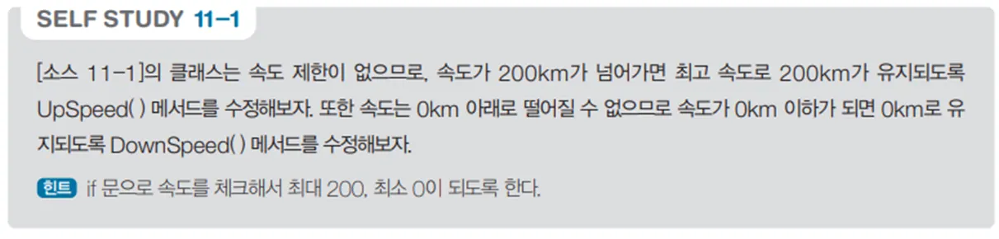

# 자동차 속도 제어 프로그램

## 문제 설명

`Car` 클래스는 자동차의 색상과 속도를 나타내며, 속도를 증가시키거나 감소시키는 메서드를 제공한다. 이 프로그램은 자동차 객체를 생성하고, 속도를 조절한 결과를 출력하는 콘솔 응용 프로그램이다.



## 코드 풀이

### 주요 클래스 설명

1. **`Car` 클래스**
   - **속성**
     - `Color`: 자동차의 색상
     - `Speed`: 현재 속도
     - `_maxSpeed`: 최대 속도(200)
   - **메서드**
     - `UpSpeed(int value)`: 속도를 `value`만큼 증가시키되, 최대 속도인 200을 초과하지 않는다.
     - `DownSpeed(int value)`: 속도를 `value`만큼 감소시키되, 최소 속도인 0 미만으로 내려가지 않는다.

   ```csharp
   public void UpSpeed(int value)
   {
       Speed = (_maxSpeed >= (Speed + value)) ? (Speed + value) : 200;
   }

   public void DownSpeed(int value)
   {
       Speed = (0 <= (Speed - value)) ? (Speed - value) : 0;
   }
   ```

2. **`CarSpeedController` 클래스**
   - 자동차 객체 3개(`car1`, `car2`, `car3`)를 생성하고 색상과 초기 속도를 설정한다.
   - 각 자동차의 속도를 조절한 결과를 콘솔에 출력한다.

   ```csharp
   Car car1 = new Car();
   car1.Color = "빨강";
   car1.Speed = 0;

   car1.UpSpeed(30);
   print.WriteLine($"자동차 1의 색상은 {car1.Color}이며, 현재 속도는 {car1.Speed}km 입니다.");
   ```

## 정리

이 프로그램은 자동차의 속도와 색상을 조절하고 표시하는 기능을 구현하였다. 속도 제한 로직과 객체 지향 프로그래밍의 기초를 학습하는 데 적합한 예제이다.