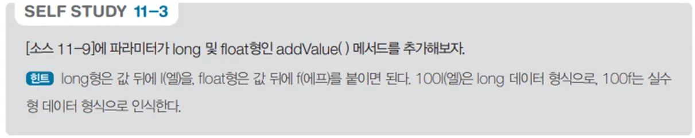

# 다양한 데이터 타입의 덧셈 연산 프로그램

## 문제 설명

이 프로그램은 `Calc` 클래스를 통해 메서드 오버로딩을 사용하여 다양한 데이터 타입의 덧셈 연산을 수행한다. `int`, `float`, `double`, `long` 타입의 두 값을 더한 결과를 출력한다.



## 코드 풀이

### 주요 코드 설명

- **`Calc` 클래스**
 - **메서드 오버로딩**
  - `AddValue` 메서드를 오버로딩하여 다양한 데이터 타입의 덧셈 연산을 처리한다.
  - 각 메서드는 동일한 이름을 가지지만, 서로 다른 매개변수 타입을 사용한다.

    ```csharp
   public int AddValue(int v1, int v2)
   {
       return v1 + v2;
   }

   public float AddValue(float v1, float v2)
   {
       return v1 + v2;
   }

   public double AddValue(double v1, double v2)
   {
       return v1 + v2;
   }

   public long AddValue(long v1, long v2)
   {
       return v1 + v2;
   }
   ```

## 정리

이 프로그램은 메서드 오버로딩을 사용하여 다양한 데이터 타입의 연산을 처리하는 방법을 보여준다. 객체 지향 프로그래밍의 핵심 개념 중 하나인 메서드 오버로딩을 학습하는 데 유용한 예제이다.