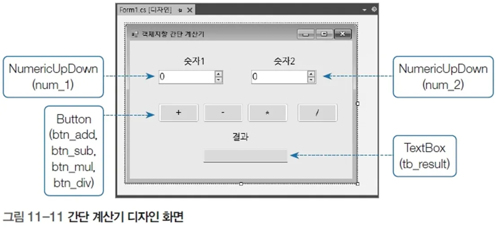

# 간단한 계산기 프로그램

## 문제 설명

이 프로그램은 두 개의 숫자를 입력받아 덧셈, 뺄셈, 곱셈, 나눗셈 연산을 수행하고 결과를 출력하는 Windows Forms 응용 프로그램이다. 각 연산은 버튼 클릭 이벤트로 실행된다.



## 코드 풀이

### 주요 기능 설명

1. **폼 초기화**
   - `Form1_Load` 메서드에서 `NumericUpDown` 컨트롤의 최대값과 최소값을 설정한다.
   - 최대값: `Int32.MaxValue`, 최소값: `Int32.MinValue`

   ```csharp
   private void Form1_Load(object sender, EventArgs e)
   {
       num1NumericUpDown.Maximum = num2NumericUpDown.Maximum = Int32.MaxValue;
       num1NumericUpDown.Minimum = num2NumericUpDown.Minimum = Int32.MinValue;
   }
   ```

2. **덧셈**
   - `addButton` 클릭 시, 두 입력값을 더한 결과를 `resultTextBox`에 출력한다.

   ```csharp
   private void addButton_Click(object sender, EventArgs e)
   {
       resultTextBox.Text = Convert.ToString(num1NumericUpDown.Value + num2NumericUpDown.Value);
   }
   ```

3. **뺄셈**
   - `subButton` 클릭 시, 두 입력값의 차를 계산하여 결과를 출력한다.

   ```csharp
   private void subButton_Click(object sender, EventArgs e)
   {
       resultTextBox.Text = Convert.ToString(num1NumericUpDown.Value - num2NumericUpDown.Value);
   }
   ```

4. **곱셈**
   - `mulButton` 클릭 시, 두 입력값을 곱한 결과를 출력한다.

   ```csharp
   private void mulButton_Click(object sender, EventArgs e)
   {
       resultTextBox.Text = Convert.ToString(num1NumericUpDown.Value * num2NumericUpDown.Value);
   }
   ```

5. **나눗셈**
   - `divButton` 클릭 시, 두 입력값을 나눈 결과를 출력한다.
   - 0으로 나누는 상황을 방지하기 위해 입력값이 0 이하인 경우 아무 작업도 하지 않는다.

   ```csharp
   private void divButton_Click(object sender, EventArgs e)
   {
       if (num1NumericUpDown.Value <= 0 || num2NumericUpDown.Value <= 0)
           return;

       resultTextBox.Text = Convert.ToString(num1NumericUpDown.Value / num2NumericUpDown.Value);
   }
   ```

### 실행 예제


1. **입력**
   - 첫 번째 숫자: `20`
   - 두 번째 숫자: `10`

2. **출력**
   - 덧셈: `30`
   - 뺄셈: `10`
   - 곱셈: `200`
   - 나눗셈: `2`

### 주요 코드 구조

- **폼 초기화**: `Form1_Load`에서 입력값 범위 설정
- **버튼 클릭 이벤트**: 연산 버튼(`addButton`, `subButton`, `mulButton`, `divButton`) 클릭 시 해당 연산 수행
- **결과 출력**: `resultTextBox`에 연산 결과 표시

## 정리

이 프로그램은 Windows Forms 컨트롤을 활용하여 간단한 계산기를 구현하였다. 사용자 입력과 출력, 기본 산술 연산, 이벤트 처리 방법을 학습하는 데 유용한 예제다.