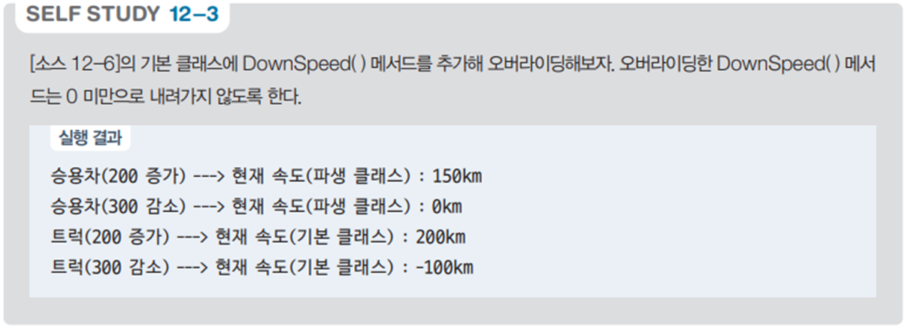
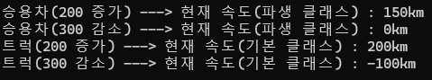

# 자동차 속도 제어 상속 프로그램

## 문제 설명

이 프로그램은 `Car` 클래스를 기반으로 `Sedan`과 `Truck` 클래스에서 속도 증가 및 감소 메서드를 오버라이드하여 고유한 동작을 구현한다. `Sedan` 클래스는 속도의 최대치를 제한하며, `Truck` 클래스는 기본 클래스의 동작을 재활용한다.



## 코드 풀이

### 주요 클래스 설명

1. **`Car` 클래스**
   - 기본 클래스: `Sedan`과 `Truck`의 부모 클래스
   - **속성**
     - `Color`: 자동차 색상
     - `Speed`: 현재 속도
   - **메서드**
     - `UpSpeed(int value)`: 속도를 입력값만큼 증가
     - `DownSpeed(int value)`: 속도를 입력값만큼 감소

   ```csharp
   public void UpSpeed(int value)
   {
       Speed += value;
       Console.WriteLine($"현재 속도(기본 클래스) : {Speed}km");
   }

   public void DownSpeed(int value)
   {
       Speed -= value;
       Console.WriteLine($"현재 속도(기본 클래스) : {Speed}km");
   }
   ```

2. **`Sedan` 클래스**
   - `Car` 클래스를 상속받아 속도의 최대치를 제한하는 동작을 구현
   - **추가 구현**
     - 최대 속도(`_maxSpeed`): 150.
     - `UpSpeed(int value)`: 최대 속도를 초과하지 않도록 제한
     - `DownSpeed(int value)`: 속도가 0 미만으로 내려가지 않도록 제한

   ```csharp
   public void UpSpeed(int value)
   {
       Speed = (Speed + value) > _maxSpeed ? _maxSpeed : (Speed + value);
       Console.WriteLine($"승용차({value} 증가) ---> 현재 속도(파생 클래스) : {Speed}km");
   }

   public void DownSpeed(int value)
   {
       Speed = (Speed - value) >= 0 ? (Speed - value) : 0;
       Console.WriteLine($"승용차({value} 감소) ---> 현재 속도(파생 클래스) : {Speed}km");
   }
   ```

3. **`Truck` 클래스**
   - `Car` 클래스를 상속받아 기본 클래스의 메서드를 호출하여 동작을 구현
   - **특징**
     - `base.UpSpeed(value)` 및 `base.DownSpeed(value)`를 사용해 부모 클래스의 동작을 그대로 재활용
     - 동작 로그에 트럭의 속도 조정 정보를 추가

   ```csharp
   public void UpSpeed(int value)
   {
       Console.Write($"트럭({value} 증가) ---> ");
       base.UpSpeed(value);
   }

   public void DownSpeed(int value)
   {
       Console.Write($"트럭({value} 감소) ---> ");
       base.DownSpeed(value);
   }
   ```

### 실행 예제



1. **출력**
   ```
   승용차(200 증가) ---> 현재 속도(파생 클래스) : 150km
   승용차(300 감소) ---> 현재 속도(파생 클래스) : 0km
   트럭(200 증가) ---> 현재 속도(기본 클래스) : 200km
   트럭(300 감소) ---> 현재 속도(기본 클래스) : -100km
   ```

2. **동작**
   - `Sedan`은 최대 속도 제한(150)과 최소 속도 제한(0)을 적용
   - `Truck`은 기본 클래스의 동작을 호출하며 속도 제한 없음

## 정리

이 프로그램은 상속과 메서드 오버라이딩을 활용하여 기본 클래스에서 공통 동작을 정의하고, 파생 클래스에서 고유한 동작을 구현하는 객체 지향 프로그래밍의 핵심 원칙을 보여준다.