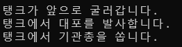

# 인터페이스를 활용한 탱크 동작 구현 프로그램

## 문제 설명

이 프로그램은 인터페이스(`ICar`, `ICannon`, `IMachineGun`)를 활용하여 `Tank` 클래스에서 탱크의 동작(전진, 대포 발사, 기관총 발사)을 구현한다.


## 코드 풀이

### 주요 구성 요소 설명

1. **`ICar` 인터페이스**
   - `Run` 메서드를 정의하며, 차량의 이동 동작을 구현하기 위한 인터페이스
   ```csharp
   interface ICar
   {
       void Run();
   }
   ```

2. **`ICannon` 인터페이스**
   - `Fire` 메서드를 정의하며, 대포 발사 동작을 구현하기 위한 인터페이스
   ```csharp
   interface ICannon
   {
       void Fire();
   }
   ```

3. **`IMachineGun` 인터페이스**
   - `Shoot` 메서드를 정의하며, 기관총 발사 동작을 구현하기 위한 인터페이스
   ```csharp
   interface IMachineGun
   {
       void Shoot();
   }
   ```

4. **`Tank` 클래스**
   - `ICar`, `ICannon`, `IMachineGun` 인터페이스를 구현
   - 구현된 메서드는 탱크의 이동, 대포 발사, 기관총 발사 동작을 정의한다.
   ```csharp
   class Tank : ICar, ICannon, IMachineGun
   {
       public void Run()
       {
           Console.WriteLine("탱크가 앞으로 굴러갑니다.");
       }

       public void Fire()
       {
           Console.WriteLine("탱크에서 대포를 발사합니다.");
       }

       public void Shoot()
       {
           Console.WriteLine("탱크에서 기관총을 쏩니다.");
       }
   }
   ```

5. **`Program` 클래스**
   - `Tank` 객체를 생성하고, `Run`, `Fire`, `Shoot` 메서드를 호출하여 각 동작을 실행한다.
   ```csharp
   public class Program
   {
       public static void Main()
       {
           Tank tank1 = new Tank();
           tank1.Run();
           tank1.Fire();
           tank1.Shoot();
       }
   }
   ```

### 실행 예제



1. **출력**
   ```
   탱크가 앞으로 굴러갑니다.
   탱크에서 대포를 발사합니다.
   탱크에서 기관총을 쏩니다.
   ```

2. **동작**
   - `Run`: 탱크가 앞으로 이동
   - `Fire`: 탱크가 대포를 발사
   - `Shoot`: 탱크가 기관총을 발사

## 정리

이 프로그램은 인터페이스를 활용하여 객체의 다양한 동작을 정의하고 구현하는 방법을 보여준다.