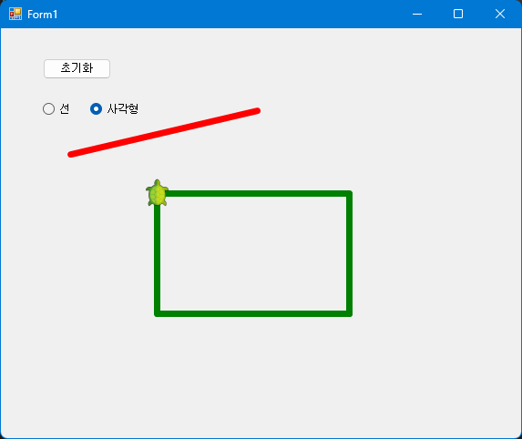

# 터틀 그래픽을 활용한 도형 그리기 프로그램

## 문제 설명

이 프로그램은 `Nakov.TurtleGraphics`를 사용하여 선(Line)과 사각형(Rectangle)을 그리는 기능을 제공한다. 사용자는 마우스 이벤트를 통해 도형의 시작점과 끝점을 지정하며, 선택된 도형 유형에 따라 화면에 그려진다.


## 코드 풀이

### 주요 클래스 설명

1. **`Figure` 추상 클래스**
   - **속성**
     - `X1`, `Y1`: 시작점의 좌표
     - `X2`, `Y2`: 끝점의 좌표
   - **추상 메서드**
     - `DrawLine()`: 도형을 그리는 메서드로, 파생 클래스에서 구현된다.

   ```csharp
   abstract class Figure
   {
       public int X1;
       public int Y1;
       public int X2;
       public int Y2;

       abstract public void DrawLine();
   }
   ```

2. **`Line` 클래스**
   - `Figure` 추상 클래스를 상속받아 선(Line)을 그리는 기능을 구현
   - **특징**
     - 시작점에서 끝점까지 빨간색 선을 그린다.

   ```csharp
   class Line : Figure
   {
       public override void DrawLine()
       {
           Turtle.PenUp();
           Turtle.MoveTo(X1, Y1);

           Turtle.PenColor = Color.Red;
           Turtle.PenDown();
           Turtle.MoveTo(X2, Y2);
       }
   }
   ```

3. **`Rectangle` 클래스**
   - `Figure` 추상 클래스를 상속받아 사각형(Rectangle)을 그리는 기능을 구현
   - **특징**
     - 초록색으로 사각형을 그린다.
     - 시작점에서 끝점까지 각 변을 그려 닫힌 도형을 생성

   ```csharp
   class Rectangle : Figure
   {
       public override void DrawLine()
       {
           Turtle.PenUp();
           Turtle.MoveTo(X1, Y1);

           Turtle.PenColor = Color.Green;
           Turtle.PenDown();
           Turtle.MoveTo(X1, Y2);
           Turtle.MoveTo(X2, Y2);
           Turtle.MoveTo(X2, Y1);
           Turtle.MoveTo(X1, Y1);
       }
   }
   ```

4. **`Form1` 클래스**
   - **마우스 이벤트**
     - `MouseDown`: 도형의 시작점(`startX`, `startY`)을 설정
     - `MouseUp`: 도형의 끝점(`endX`, `endY`)을 설정하고, 선택된 도형을 그린다.
   - **도형 초기화**
     - `initButton_Click`: 터틀 그래픽을 초기화하여 화면을 리셋

   ```csharp
   private void Form1_MouseUp(object sender, MouseEventArgs e)
   {
       endX = e.X;
       endY = e.Y;
       endX -= ClientSize.Width / 2;
       endY = ClientSize.Height / 2 - endY;

       if (lineRadioButton.Checked)
       {
           Line line1 = new Line(startX, startY, endX, endY);
           line1.DrawLine();
       }
       else
       {
           Rectangle rect1 = new Rectangle(startX, startY, endX, endY);
           rect1.DrawLine();
       }
   }
   ```

### 주요 동작 설명

1. **도형 선택**
   - 라디오 버튼(`lineRadioButton`, `rectangleRadioButton`)을 통해 그릴 도형을 선택

2. **마우스 이벤트**
   - `MouseDown`: 시작점 설정
   - `MouseUp`: 끝점 설정 및 도형 그리기

3. **도형 초기화**
   - 초기화 버튼 클릭 시 `Turtle.Reset()`을 호출하여 화면을 리셋

### 실행 예제



1. **도형 그리기**
   - 마우스 클릭으로 시작점 설정
   - 드래그 후 마우스 버튼을 놓아 끝점 설정
   - 선택한 도형이 화면에 그려짐

2. **초기화**
   - 초기화 버튼을 클릭하면 그려진 모든 도형이 제거됨

### 주요 코드 구조

- **추상 클래스**: `Figure`는 공통 속성과 메서드를 정의
- **다형성**: `Line`과 `Rectangle`은 `Figure`의 추상 메서드를 구현하여 각각의 동작 정의
- **이벤트 처리**: 마우스 이벤트를 통해 도형의 시작점과 끝점을 설정

## 정리

이 프로그램은 터틀 그래픽과 마우스 이벤트를 활용하여 다양한 도형을 그리는 기능을 제공한다.