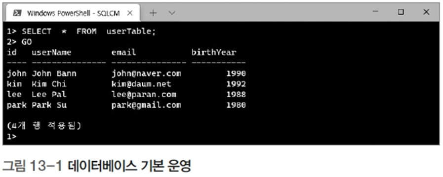

# 데이터베이스 기본 운영

## 설명



### 1. 데이터베이스 생성
- `create database naverDB;`
  - **기능**: `naverDB`라는 이름의 데이터베이스를 생성한다.
- `use naverDB;`
  - **기능**: 이후의 작업을 `naverDB` 데이터베이스에서 실행하도록 설정한다.

### 2. 테이블 생성
- `create table userTable (...)`
  - **기능**: `userTable`이라는 테이블을 생성한다.
  - **컬럼**
    - `id`: 사용자 ID, `char(4)` 타입.
    - `userName`: 사용자 이름, `char(15)` 타입.
    - `email`: 이메일 주소, `char(15)` 타입.
    - `birthYear`: 태어난 연도, `int` 타입.

### 3. 데이터 삽입
- `insert into userTable values(...)`
  - **기능**: 테이블에 데이터를 삽입한다.
  - **데이터**
    - `('john', 'John Bann', 'john@naver.com', 1990)`
    - `('kim', 'Kim Chi', 'kim@daum.net', 1992)`
    - `('lee', 'Lee Pal', 'lee@paran.com', 1988)`
    - `('park', 'Park Su', 'park@gmail.com', 1980)`

### 4. 데이터 조회
- `select * from userTable;`
  - **기능**: `userTable`에 저장된 모든 데이터를 조회한다.

# 실행 결과


1. **조회 결과**
   ```
   id   | userName    | email          | birthYear
   -----+-------------+----------------+----------
   john | John Bann   | john@naver.com | 1990
   kim  | Kim Chi     | kim@daum.net   | 1992
   lee  | Lee Pal     | lee@paran.com  | 1988
   park | Park Su     | park@gmail.com | 1980
   ```

# 개선 및 유의사항

1. **`char` 타입**
   - `char`는 고정 길이 문자열을 저장하므로 실제 데이터 길이가 작을 경우 공간 낭비가 발생할 수 있다.
   - **개선**: `varchar`를 사용하여 가변 길이 문자열로 설정하는 것이 효율적이다.
     ```sql
     create table userTable (
         id varchar(4),
         userName varchar(15),
         email varchar(15),
         birthYear int
     );
     ```

2. **데이터 무결성**
   - 데이터의 유일성을 보장하거나 불필요한 값 삽입을 방지하기 위해 제약 조건을 추가할 수 있다.
   - **개선**
     ```sql
     create table userTable (
         id varchar(4) primary key,
         userName varchar(15) not null,
         email varchar(50) unique not null,
         birthYear int check (birthYear >= 1900 and birthYear <= 2023)
     );
     ```